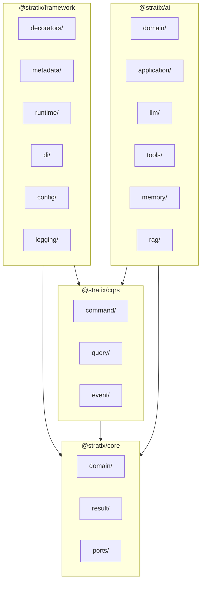

# Analisis de Estructura de Carpetas - Stratix Framework

## Estado Actual

```
src/
├── ai-agents/         (60+ archivos - sistema de agentes IA)
├── configuration/     (7 archivos)
├── context/           (4 archivos)
├── cqrs/              (11 archivos)
├── decorators/        (3 archivos)
├── defaults/          (1 archivo)
├── di/                (4 archivos)
├── domain/            (8 archivos)
├── errors/            (8 archivos)
├── logging/           (10 archivos)
├── metadata/          (6 archivos)
├── plugin/            (3 archivos)
├── result/            (4 archivos)
├── runtime/           (2 archivos)
├── validation/        (1 archivo)
└── index.ts           (vacio)
```

**Total: 141 archivos TypeScript**

---

## Problemas Identificados

### 1. Modulo ai-agents demasiado grande

El modulo `ai-agents/` contiene 60+ archivos con 16 subdirectorios. Esto dificulta:
- Navegacion del codigo
- Comprension de responsabilidades
- Testing aislado
- Versionado independiente

### 2. Falta de separacion core vs framework

Actualmente todo esta mezclado en un solo paquete. No hay distincion clara entre:
- **Abstracciones puras** (interfaces, tipos, contratos)
- **Implementaciones concretas** (decoradores, runtime, adaptadores)

### 3. Index.ts raiz vacio

El archivo `src/index.ts` esta vacio, lo que significa que no hay API publica definida para consumidores del framework.

### 4. Inconsistencias en CQRS

- `InMemoryCommandBus` existe pero no hay implementaciones para `QueryBus` ni `EventBus`
- Las interfaces estan definidas pero incompletas

### 5. Carpeta defaults aislada

Solo contiene `Defaults.ts`. Deberia estar integrada en otro modulo.

### 6. Modulos pequenos dispersos

- `validation/` tiene solo 1 archivo
- `plugin/` tiene solo 3 archivos
- `context/` tiene solo 4 archivos

---

## Propuestas de Mejora

### Opcion A: Reorganizacion por Capas (Hexagonal)

Reorganizar siguiendo estrictamente la arquitectura hexagonal:

```
src/
├── core/                      # Nucleo del dominio (sin dependencias externas)
│   ├── domain/                # Primitivas DDD
│   │   ├── Entity.ts
│   │   ├── AggregateRoot.ts
│   │   ├── ValueObject.ts
│   │   ├── EntityId.ts
│   │   ├── DomainEvent.ts
│   │   └── DomainError.ts
│   ├── result/                # Patron Result
│   ├── messaging/             # Interfaces CQRS (solo contratos)
│   │   ├── Command.ts
│   │   ├── Query.ts
│   │   ├── Event.ts
│   │   └── buses/             # Interfaces de buses
│   └── ports/                 # Puertos (interfaces de infraestructura)
│       ├── Container.ts
│       ├── Logger.ts
│       ├── ConfigurationProvider.ts
│       └── Repository.ts
│
├── application/               # Capa de aplicacion
│   ├── services/              # Servicios de aplicacion
│   └── handlers/              # Base para handlers CQRS
│
├── infrastructure/            # Implementaciones concretas
│   ├── di/                    # Awilix adapter
│   ├── logging/               # Implementaciones de logger
│   ├── configuration/         # YAML, Environment sources
│   ├── messaging/             # InMemory buses
│   └── persistence/           # Repositorios (futuro)
│
├── framework/                 # Framework decorator-based
│   ├── decorators/            # @StratixApp, @Context, etc.
│   ├── metadata/              # Sistema de metadata
│   ├── runtime/               # StratixApplication, bootstrap
│   └── context/               # Bounded contexts
│
├── ai/                        # Sistema de agentes (separado)
│   ├── domain/                # AgentSpecification, LLMPort
│   ├── application/           # AgentService
│   ├── llm/                   # Interfaces LLM
│   ├── tools/                 # Sistema de tools
│   ├── memory/                # Memoria de agentes
│   ├── prompts/               # Templates
│   ├── guardrails/            # Validacion
│   ├── rag/                   # Retrieval
│   ├── workflows/             # Motor de workflows
│   └── observability/         # Telemetria y tracing
│
└── index.ts                   # API publica del framework
```

**Ventajas:**
- Clara separacion de responsabilidades
- Facil identificar que es abstracto vs concreto
- AI como modulo independiente y opcional
- Facilita futuro split en multiples paquetes

**Desventajas:**
- Requiere refactoring significativo
- Cambio de imports en todo el codigo

---

### Opcion B: Reorganizacion por Feature Modules

Organizar por funcionalidades cohesivas:

```
src/
├── shared/                    # Codigo compartido
│   ├── result/
│   ├── errors/
│   └── types/
│
├── ddd/                       # Primitivas DDD
│   ├── entity/
│   ├── aggregate/
│   ├── value-object/
│   └── domain-event/
│
├── cqrs/                      # Sistema CQRS completo
│   ├── command/
│   ├── query/
│   ├── event/
│   └── buses/
│       ├── interfaces/
│       └── in-memory/
│
├── container/                 # DI completo
│   ├── interfaces/
│   └── awilix/
│
├── config/                    # Configuracion completa
│   ├── interfaces/
│   ├── yaml/
│   └── environment/
│
├── logging/                   # Logging completo
│   ├── interfaces/
│   ├── console/
│   └── file/
│
├── decorators/                # Sistema de decoradores
│   ├── app/
│   ├── context/
│   ├── handlers/
│   └── metadata/
│
├── runtime/                   # Runtime del framework
│
├── ai-agents/                 # Sistema AI (sin cambios internos)
│
└── index.ts
```

**Ventajas:**
- Menor cambio respecto a estructura actual
- Cada feature es autocontenida
- Facil de entender para nuevos desarrolladores

**Desventajas:**
- No separa claramente abstracciones de implementaciones
- Puede llevar a dependencias circulares

---

### Opcion C: Monorepo con Paquetes Internos (Recomendada)

Estructura hibrida preparada para futura separacion:

```
src/
├── @stratix/
│   ├── core/                  # Zero dependencies - publicable
│   │   ├── domain/
│   │   ├── result/
│   │   ├── ports/             # Interfaces puras
│   │   └── index.ts
│   │
│   ├── cqrs/                  # CQRS abstractions - publicable
│   │   ├── command/
│   │   ├── query/
│   │   ├── event/
│   │   └── index.ts
│   │
│   ├── ai/                    # AI agents - publicable separado
│   │   ├── domain/
│   │   ├── application/
│   │   ├── llm/
│   │   ├── tools/
│   │   ├── memory/
│   │   ├── prompts/
│   │   ├── guardrails/
│   │   ├── rag/
│   │   ├── workflows/
│   │   ├── observability/
│   │   └── index.ts
│   │
│   └── framework/             # Decorator runtime - publicable
│       ├── decorators/
│       ├── metadata/
│       ├── runtime/
│       ├── di/
│       ├── config/
│       ├── logging/
│       └── index.ts
│
└── index.ts                   # Re-exporta todo
```

**Ventajas:**
- Preparado para split en npm packages
- Clara separacion de concerns
- Cada "paquete interno" puede tener su propio CLAUDE.md
- Versionado semantico por modulo (futuro)
- AI puede ser opcional

**Desventajas:**
- Estructura mas compleja
- Requiere convencion de imports interna

---

## Mejoras Inmediatas (Sin Refactoring Mayor)

### 1. Poblar src/index.ts

```typescript
// src/index.ts
// Domain primitives
export * from './domain/index.js';
export * from './result/index.js';

// CQRS
export * from './cqrs/command/index.js';
export * from './cqrs/query/index.js';
export * from './cqrs/event/index.js';

// Framework
export * from './decorators/index.js';
export * from './runtime/index.js';
export * from './metadata/index.js';

// Infrastructure
export * from './container/index.js';
export * from './config/index.js';
export * from './logging/index.js';

// AI Agents (opcional, re-export selectivo)
export * as AI from './ai/index.js';
```

### 2. Mover defaults a configuration

```
configuration/
├── defaults/
│   └── Defaults.ts
├── ConfigurationManager.ts
└── ...
```

### 3. Crear implementaciones faltantes en CQRS

```
cqrs/
├── command/
│   └── InMemoryCommandBus.ts  (existe)
├── query/
│   └── InMemoryQueryBus.ts    (crear)
└── event/
    └── InMemoryEventBus.ts    (crear)
```

### 4. Consolidar validation

Mover `validation/` dentro de `domain/` o `shared/`:

```
domain/
├── validation/
│   └── Validator.ts
└── ...
```

### 5. Renombrar ai-agents a ai

Nombre mas corto y consistente:

```
src/ai/    # en lugar de src/ai-agents/
```

---

## Diagrama de Dependencias Propuesto



---

## Recomendacion Final

**Corto plazo:** Implementar las mejoras inmediatas (items 1-5) sin refactoring mayor.

**Mediano plazo:** Adoptar la **Opcion C** (monorepo con paquetes internos) para preparar el framework para:
- Publicacion de paquetes separados en npm
- Instalacion selectiva (`@stratix/core` sin `@stratix/ai`)
- Mejor testing y mantenimiento

**Prioridad de cambios:**
1. Poblar `src/index.ts` con API publica
2. Implementar `InMemoryQueryBus` e `InMemoryEventBus`
3. Consolidar modulos pequenos (defaults, validation)
4. Renombrar `ai-agents` a `ai`
5. Planificar migracion a estructura de paquetes internos
