# Metadata System Architecture Diagrams

## Current Architecture

### Storage Structure

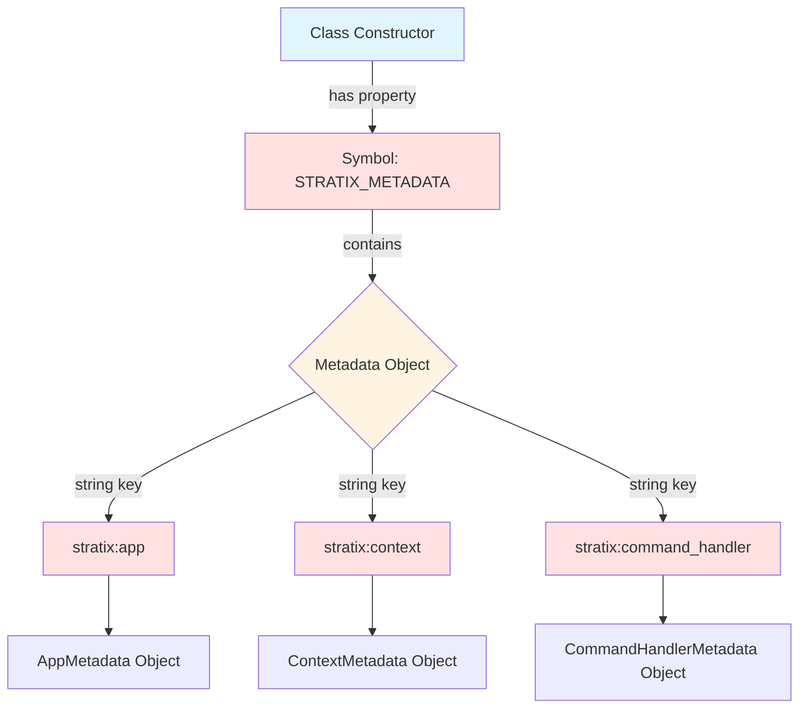

### Component Interaction Flow

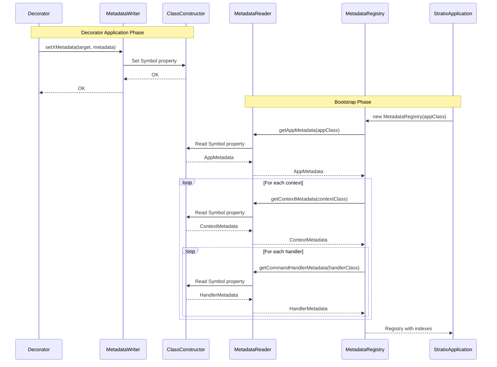

### Current Problems

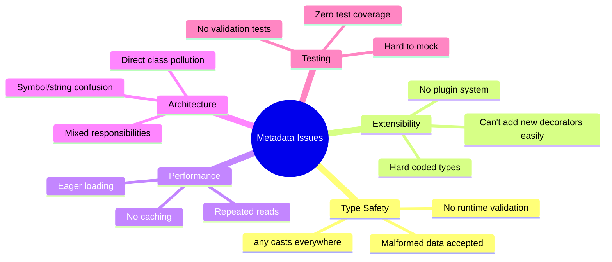

## Proposed Architecture

### Improved Storage Structure

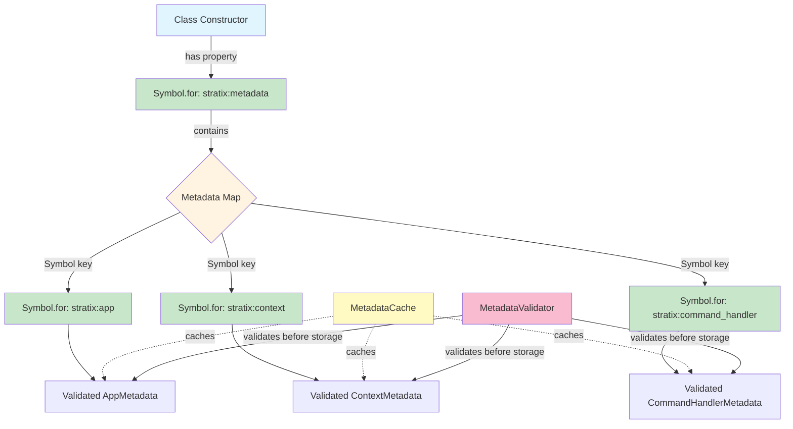

### Improved Component Architecture

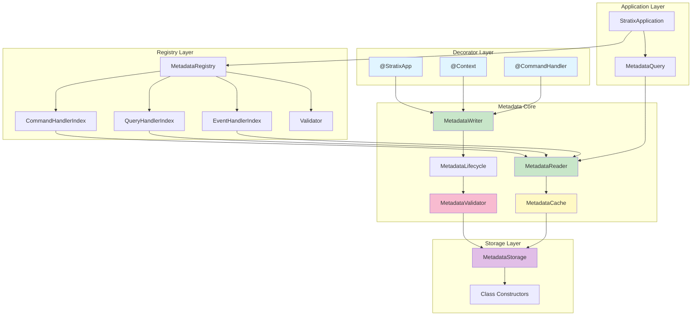

### Metadata Lifecycle

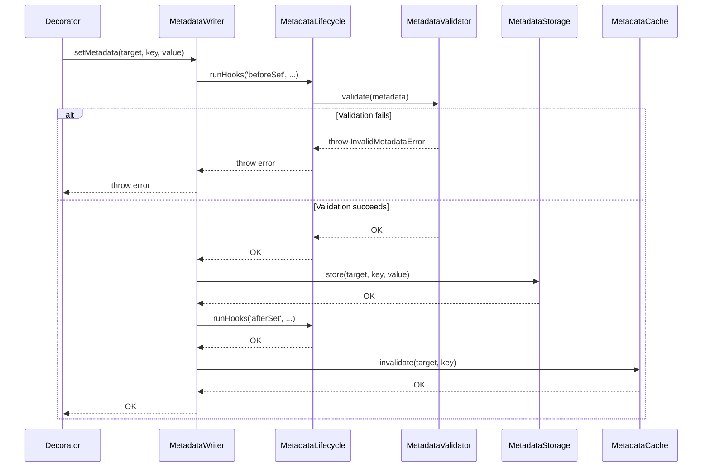

### Improved MetadataRegistry Separation

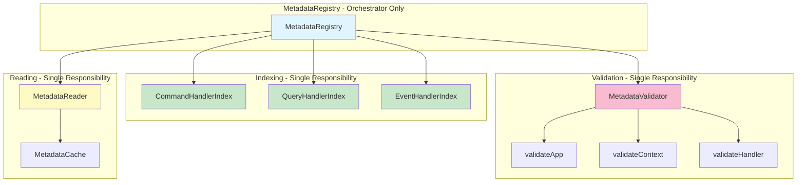

### Type Safety Flow

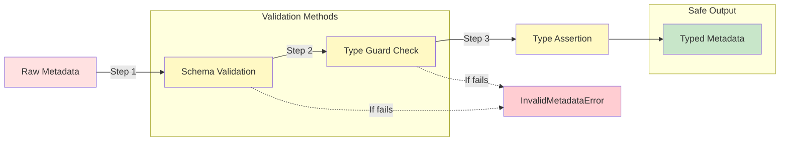

### Metadata Inheritance

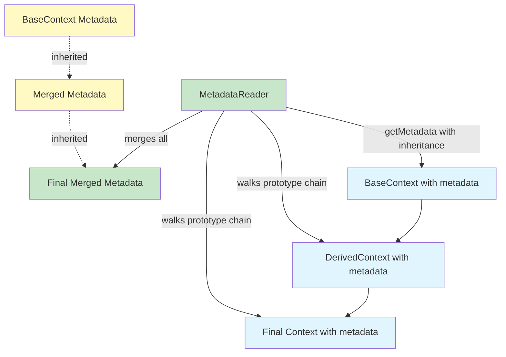

### Query API Architecture

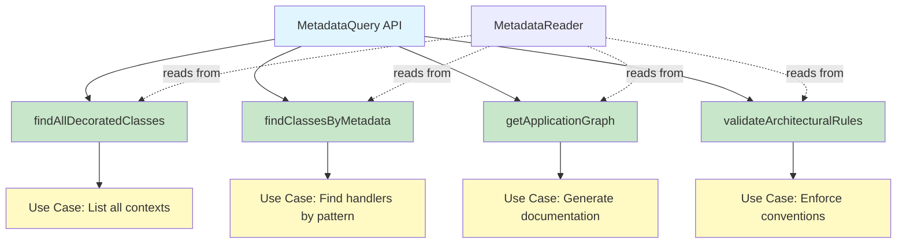

## Comparison: Before and After

### Storage Mechanism

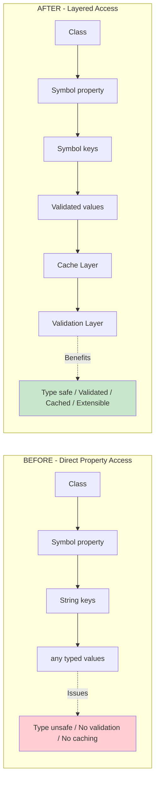

### Extensibility

```mermaid
graph TB
    subgraph BEFORE["BEFORE - Hard Coded"]
        A1[Add New Decorator] --> B1[1. Modify metadataKeys.ts]
        B1 --> C1[2. Modify types.ts]
        C1 --> D1[3. Modify MetadataWriter]
        D1 --> E1[4. Modify MetadataReader]
        E1 --> F1[5. Modify MetadataRegistry]
        F1 -.->|Issues| G1[5 files to change / High coupling / Error prone]
    end

    subgraph AFTER["AFTER - Plugin Based"]
        A2[Add New Decorator] --> B2[1. Define metadata type]
        B2 --> C2[2. Create Symbol key]
        C2 --> D2[3. Use generic API]
        D2 -.->|Benefits| E2[3 steps / No core changes / Type safe]
    end

    style G1 fill:#ffcdd2
    style E2 fill:#c8e6c9
```

## Implementation Phases

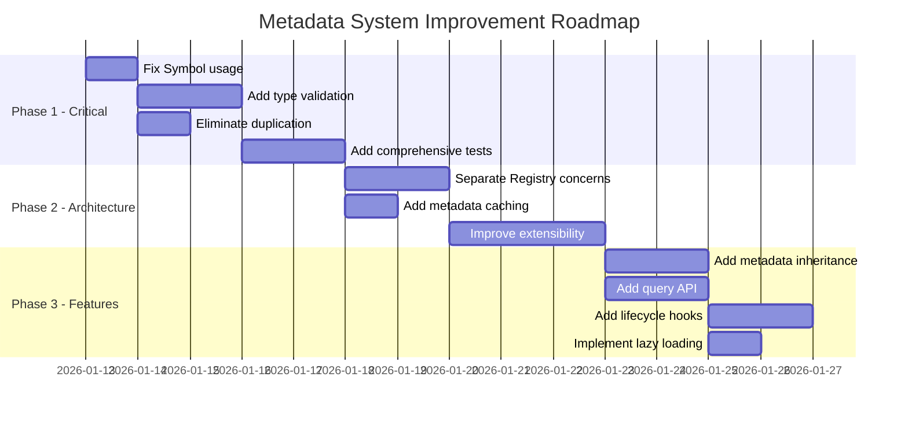

## Decision Tree: When to Use Each Pattern

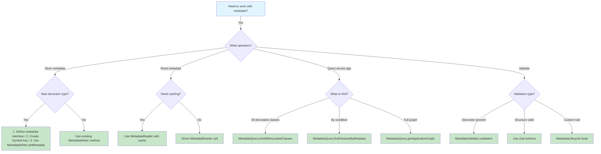
