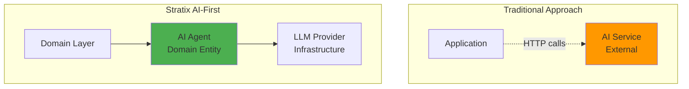

# AI Agents Overview

Stratix treats **AI agents as first-class domain entities**, not as afterthoughts or external services. This AI-first approach enables you to build production-ready AI applications with the same rigor as traditional business logic.

## Why AI-First?

Traditional frameworks treat AI as an external integration. Stratix is different:



### Benefits

✅ **Type Safety** - AI agents are strongly typed TypeScript classes  
✅ **Testability** - Mock LLM providers for testing  
✅ **Versioning** - Track agent versions like any other code  
✅ **Observability** - Built-in execution tracing and metrics  
✅ **Production Patterns** - Memory management, error handling, cost tracking  

## AIAgent Base Class

All AI agents extend the `AIAgent` base class:

```typescript
import { AIAgent, AgentResult, AgentCapabilities } from '@stratix/core';

class CustomerSupportAgent extends AIAgent<string, string> {
  readonly name = 'Customer Support Agent';
  readonly description = 'Handles customer inquiries and support tickets';
  readonly version = AgentVersionFactory.create('1.0.0');
  readonly capabilities = [AgentCapabilities.TEXT_GENERATION];
  
  readonly model = {
    provider: 'openai',
    model: 'gpt-4o',
    temperature: 0.7,
    maxTokens: 1000
  };

  constructor(private llmProvider: LLMProvider) {
    super(EntityId.create<'AIAgent'>(), new Date(), new Date());
  }

  protected async execute(input: string): Promise<AgentResult<string>> {
    const response = await this.llmProvider.chat({
      model: this.model.model,
      messages: [
        { role: 'system', content: 'You are a helpful customer support agent.' },
        { role: 'user', content: input, timestamp: new Date() }
      ],
      temperature: this.model.temperature,
      maxTokens: this.model.maxTokens
    });

    return AgentResult.success(response.content, {
      model: response.model,
      totalTokens: response.usage.totalTokens,
      cost: this.llmProvider.calculateCost(this.model.model, response.usage)
    });
  }
}
```

## Agent Capabilities

Stratix defines standard agent capabilities:

```typescript
import { AgentCapabilities } from '@stratix/core';

enum AgentCapabilities {
  TEXT_GENERATION = 'TEXT_GENERATION',
  TEXT_ANALYSIS = 'TEXT_ANALYSIS',
  CODE_GENERATION = 'CODE_GENERATION',
  FUNCTION_CALLING = 'FUNCTION_CALLING',
  VISION = 'VISION',
  AUDIO = 'AUDIO',
  EMBEDDINGS = 'EMBEDDINGS'
}
```

## LLM Providers

Stratix supports multiple LLM providers out of the box:

### OpenAI

```typescript
import { OpenAIProvider } from '@stratix/ai-openai';

const provider = new OpenAIProvider({
  apiKey: process.env.OPENAI_API_KEY!
});

const agent = new CustomerSupportAgent(provider);
```

### Anthropic (Claude)

```typescript
import { AnthropicProvider } from '@stratix/ai-anthropic';

const provider = new AnthropicProvider({
  apiKey: process.env.ANTHROPIC_API_KEY!
});

const agent = new CustomerSupportAgent(provider);
```

### Custom Providers

```typescript
import { LLMProvider } from '@stratix/core';

class CustomLLMProvider implements LLMProvider {
  async chat(request: ChatRequest): Promise<ChatResponse> {
    // Your implementation
  }

  async streamChat(request: ChatRequest): AsyncGenerator<ChatChunk> {
    // Your implementation
  }

  calculateCost(model: string, usage: TokenUsage): number {
    // Your implementation
  }
}
```

## Agent Execution

### Basic Execution

```typescript
const agent = new CustomerSupportAgent(llmProvider);

const result = await agent.run('How do I reset my password?');

if (result.isSuccess) {
  console.log('Response:', result.output);
  console.log('Tokens used:', result.metadata.totalTokens);
  console.log('Cost:', result.metadata.cost);
} else {
  console.error('Error:', result.error);
}
```

### With Context

```typescript
const context = new AgentContext({
  userId: 'user-123',
  sessionId: 'session-456',
  metadata: {
    customerTier: 'premium',
    language: 'en'
  }
});

const result = await agent.run(input, context);
```

## Production Features

### 1. Execution Tracing

Track every agent execution:

```typescript
const result = await agent.run(input);

const trace = result.trace;
console.log('Started:', trace.startedAt);
console.log('Completed:', trace.completedAt);
console.log('Duration:', trace.duration);
console.log('Steps:', trace.steps);
```

### 2. Cost Tracking

Monitor LLM costs:

```typescript
const result = await agent.run(input);

console.log('Tokens:', result.metadata.totalTokens);
console.log('Cost:', result.metadata.cost);

// Aggregate costs
let totalCost = 0;
for (const execution of executions) {
  totalCost += execution.metadata.cost;
}
```

### 3. Error Handling

Robust error handling with Result pattern:

```typescript
const result = await agent.run(input);

if (result.isSuccess) {
  // Handle success
  console.log(result.output);
} else {
  // Handle error
  if (result.error instanceof AgentBudgetExceededError) {
    console.error('Budget exceeded');
  } else if (result.error instanceof AgentTimeoutError) {
    console.error('Timeout');
  } else {
    console.error('Unknown error:', result.error);
  }
}
```

### 4. Memory Management

Agents can maintain conversation history:

```typescript
import { InMemoryAgentMemory } from '@stratix/runtime';

const memory = new InMemoryAgentMemory();

class ConversationalAgent extends AIAgent<string, string> {
  async execute(input: string): Promise<AgentResult<string>> {
    // Load conversation history
    const history = await memory.getMessages(this.id);

    const response = await this.llmProvider.chat({
      model: this.model.model,
      messages: [
        ...history,
        { role: 'user', content: input, timestamp: new Date() }
      ]
    });

    // Save to memory
    await memory.addMessage(this.id, {
      role: 'user',
      content: input,
      timestamp: new Date()
    });
    await memory.addMessage(this.id, {
      role: 'assistant',
      content: response.content,
      timestamp: new Date()
    });

    return AgentResult.success(response.content, response.usage);
  }
}
```

## Agent Orchestration

Coordinate multiple agents:

```typescript
import { StratixAgentOrchestrator } from '@stratix/runtime';

const orchestrator = new StratixAgentOrchestrator();

// Register agents
orchestrator.registerAgent('support', supportAgent);
orchestrator.registerAgent('sales', salesAgent);
orchestrator.registerAgent('technical', technicalAgent);

// Route to appropriate agent
const result = await orchestrator.route(userInput, {
  strategy: 'intent-based',
  fallback: 'support'
});
```

## Integration with Domain

Agents are domain entities and can be used in CQRS:

```typescript
// Command
export class AnalyzeCustomerFeedbackCommand implements Command {
  constructor(
    public readonly feedbackId: string,
    public readonly text: string
  ) {}
}

// Handler
export class AnalyzeCustomerFeedbackHandler 
  implements CommandHandler<AnalyzeCustomerFeedbackCommand, FeedbackAnalysis> {
  
  constructor(
    private analysisAgent: FeedbackAnalysisAgent,
    private feedbackRepository: IFeedbackRepository
  ) {}

  async handle(command: AnalyzeCustomerFeedbackCommand): Promise<Result<FeedbackAnalysis>> {
    // Run AI agent
    const result = await this.analysisAgent.run(command.text);

    if (result.isFailure) {
      return Failure.create(result.error);
    }

    // Create domain entity
    const analysis = new FeedbackAnalysis(
      EntityId.create<'FeedbackAnalysis'>(),
      command.feedbackId,
      result.output,
      new Date(),
      new Date()
    );

    // Persist
    await this.feedbackRepository.saveAnalysis(analysis);

    return Success.create(analysis);
  }
}
```

## HTTP Integration

Expose agents via HTTP:

```typescript
import { FastifyHTTPPlugin } from '@stratix/http-fastify';

httpPlugin.post('/api/agents/support', async (request) => {
  const { message } = request.body;

  const result = await supportAgent.run(message);

  if (result.isFailure) {
    throw HttpErrorImpl.internalServerError(result.error.message);
  }

  return {
    body: {
      response: result.output,
      metadata: {
        tokens: result.metadata.totalTokens,
        cost: result.metadata.cost,
        duration: result.trace.duration
      }
    }
  };
});
```

## Testing Agents

Use MockLLMProvider for testing:

```typescript
import { MockLLMProvider } from '@stratix/testing';

describe('CustomerSupportAgent', () => {
  it('should respond to password reset question', async () => {
    const mockProvider = new MockLLMProvider({
      responses: [
        'To reset your password, click "Forgot Password" on the login page.'
      ]
    });

    const agent = new CustomerSupportAgent(mockProvider);
    const result = await agent.run('How do I reset my password?');

    expect(result.isSuccess).toBe(true);
    expect(result.output).toContain('Forgot Password');
  });
});
```

## Real-World Example

```typescript
// Domain entity
class ProductRecommendationAgent extends AIAgent<ProductQuery, ProductRecommendation[]> {
  readonly name = 'Product Recommendation Agent';
  readonly version = AgentVersionFactory.create('1.0.0');
  readonly capabilities = [AgentCapabilities.TEXT_GENERATION];

  constructor(
    private llmProvider: LLMProvider,
    private productRepository: IProductRepository
  ) {
    super(EntityId.create<'AIAgent'>(), new Date(), new Date());
  }

  protected async execute(query: ProductQuery): Promise<AgentResult<ProductRecommendation[]>> {
    // Get available products
    const products = await this.productRepository.findAll();

    // Build prompt
    const prompt = `
      User preferences: ${query.preferences}
      Budget: ${query.budget}
      
      Available products:
      ${products.map(p => `- ${p.name}: $${p.price}`).join('\n')}
      
      Recommend the top 3 products and explain why.
    `;

    // Call LLM
    const response = await this.llmProvider.chat({
      model: 'gpt-4o',
      messages: [
        { role: 'system', content: 'You are a product recommendation expert.' },
        { role: 'user', content: prompt, timestamp: new Date() }
      ]
    });

    // Parse recommendations
    const recommendations = this.parseRecommendations(response.content);

    return AgentResult.success(recommendations, response.usage);
  }

  private parseRecommendations(text: string): ProductRecommendation[] {
    // Parse LLM response into structured data
    // ...
  }
}
```

## Best Practices

### 1. Version Your Agents

```typescript
readonly version = AgentVersionFactory.create('1.2.0');
```

### 2. Define Clear Capabilities

```typescript
readonly capabilities = [
  AgentCapabilities.TEXT_GENERATION,
  AgentCapabilities.FUNCTION_CALLING
];
```

### 3. Use Result Pattern

```typescript
const result = await agent.run(input);
if (result.isSuccess) {
  // Handle success
} else {
  // Handle error
}
```

### 4. Track Costs

```typescript
console.log('Cost:', result.metadata.cost);
```

### 5. Test with Mocks

```typescript
const mockProvider = new MockLLMProvider({ responses: [...] });
```

## Next Steps

- **[Creating Agents](./creating-agents)** - Build your first agent
- **[LLM Providers](./llm-providers)** - OpenAI, Anthropic, custom providers
- **[Agent Tools](./agent-tools)** - Function calling and tools
- **[Agent Memory](./agent-memory)** - Conversation history
- **[Agent Orchestration](./agent-orchestration)** - Multi-agent workflows
- **[Agent Testing](./agent-testing)** - Testing strategies
