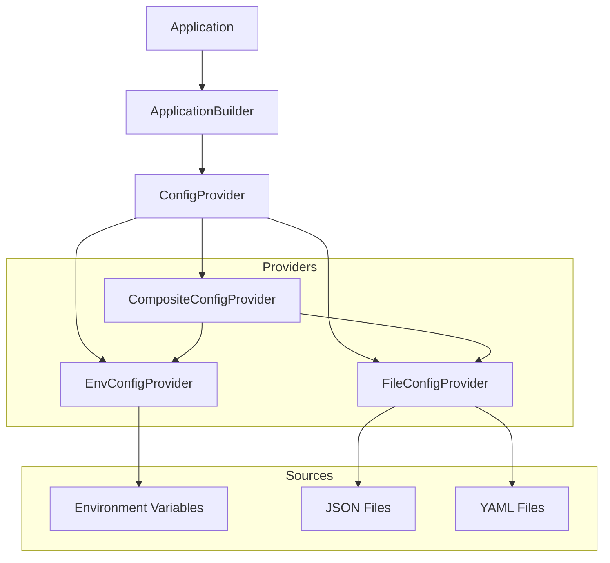

# Configuration Overview

Stratix provides a powerful, type-safe configuration system that supports multiple sources, automatic validation, and hot reload capabilities.

## Why Configuration Management?

Modern applications need flexible configuration that:

- **Adapts to Different Environments**: Development, staging, production
- **Stays Type-Safe**: Prevent runtime errors from misconfiguration
- **Validates Early**: Catch configuration errors at startup
- **Supports Multiple Sources**: ENV vars, files, remote sources
- **Changes Without Restart**: Hot reload for development

## Architecture

The configuration system consists of:

1. **Core Interface** (`ConfigProvider`) - Defined in `@stratix/core`
2. **Provider Implementations** - Different sources of configuration
3. **Runtime Integration** - Automatic DI registration and lifecycle



## Available Providers

### EnvConfigProvider

Environment variable-based configuration with automatic type transformation.

**Best for:**
- Production deployments
- Container environments (Docker, Kubernetes)
- 12-factor applications
- CI/CD pipelines

```typescript
import { EnvConfigProvider } from '@stratix/config-env';

const config = new EnvConfigProvider({
  prefix: 'APP_',
  autoTransform: true,
});
```

[Learn more →](./env-provider)

### FileConfigProvider

File-based configuration supporting JSON and YAML with hot reload.

**Best for:**
- Development environments
- Multiple environment configurations
- Configuration in version control
- Hot reload during development

```typescript
import { FileConfigProvider } from '@stratix/config-file';

const config = new FileConfigProvider({
  files: ['./config/default.json', './config/production.json'],
  watch: true,
});
```

[Learn more →](./file-provider)

### CompositeConfigProvider

Combines multiple configuration providers with priority strategies.

**Best for:**
- Enterprise applications
- Multiple configuration sources
- Environment variable overrides
- Complex configuration hierarchies

```typescript
import { CompositeConfigProvider } from '@stratix/config-composite';

const config = new CompositeConfigProvider({
  providers: [envProvider, fileProvider],
  strategy: 'first-wins',
});
```

[Learn more →](./composite-provider)

## Quick Comparison

| Feature | EnvConfigProvider | FileConfigProvider | CompositeConfigProvider |
|---------|------------------|-------------------|------------------------|
| **Source** | ENV variables | JSON/YAML files | Multiple providers |
| **Type transformation** | ✅ Automatic | ❌ Preserves types | ✅ Inherited |
| **Hot reload** | ❌ No | ✅ Yes (optional) | ✅ If supported |
| **Validation** | ✅ Schemas | ✅ Schemas | ✅ Schemas |
| **Nested objects** | ✅ Via `__` | ✅ Native | ✅ Native |
| **Best for** | Production | Development | Enterprise |

## Basic Usage

### 1. Install Provider

```bash
npm install @stratix/config-env
# or
npm install @stratix/config-file
# or
npm install @stratix/config-composite
```

### 2. Configure Application

```typescript
import { ApplicationBuilder } from '@stratix/runtime';
import { EnvConfigProvider } from '@stratix/config-env';

const app = await ApplicationBuilder.create()
  .useConfig(new EnvConfigProvider({
    prefix: 'APP_',
  }))
  .useContainer(container)
  .useLogger(logger)
  .build();
```

### 3. Use in Handlers

Configuration is automatically injected via DI:

```typescript
class CreateUserHandler implements CommandHandler<CreateUserCommand> {
  constructor(
    private readonly config: ConfigProvider,
    private readonly repository: UserRepository,
  ) {}

  async handle(command: CreateUserCommand): Promise<Result<User>> {
    const maxUsers = await this.config.get<number>('limits.maxUsers', 1000);

    // Use configuration...
  }
}
```

## Key Features

### Type Safety

All providers support generic types:

```typescript
const port = await config.getRequired<number>('server.port');
const features = await config.getNamespace<FeatureFlags>('features');
```

### Validation

Validate configuration at startup with schemas (Zod, etc.):

```typescript
import { z } from 'zod';

const schema = z.object({
  port: z.number().int().positive(),
  host: z.string().default('localhost'),
});

const provider = new EnvConfigProvider({
  schema: {
    async validate(data) {
      const result = schema.safeParse(data);
      return result.success
        ? { success: true, data: result.data }
        : { success: false, errors: /* ... */ };
    },
  },
});
```

### Nested Configuration

Access nested values with dot notation:

```typescript
// Environment: APP_DATABASE__POOL__SIZE=10
const poolSize = await config.get<number>('database.pool.size');

// Or get entire namespace
const dbConfig = await config.getNamespace('database');
```

### Default Values

Provide fallback values:

```typescript
const timeout = await config.get<number>('api.timeout', 5000);
```

## Best Practices

### 1. Validate Early

Always validate configuration at application startup:

```typescript
async function bootstrap() {
  try {
    const config = await configProvider.getAll();
    // Configuration is valid, start application
  } catch (error) {
    console.error('Invalid configuration:', error);
    process.exit(1);
  }
}
```

### 2. Separate Secrets

Use `SecretsProvider` for sensitive data:

```typescript
// ✅ Public configuration
const dbHost = await config.get('database.host');

// ✅ Sensitive data
const dbPassword = await secrets.getRequired('database.password');
```

### 3. Use Namespaces

Organize configuration by domain:

```typescript
const serverConfig = await config.getNamespace('server');
const cacheConfig = await config.getNamespace('cache');
const dbConfig = await config.getNamespace('database');
```

### 4. Type Everything

Use TypeScript interfaces and Zod schemas:

```typescript
interface AppConfig {
  server: {
    port: number;
    host: string;
  };
  database: {
    url: string;
    poolSize: number;
  };
}

const config = await provider.getAll<AppConfig>();
```

## Next Steps

- [EnvConfigProvider Guide](./env-provider) - Environment variables
- [FileConfigProvider Guide](./file-provider) - JSON/YAML files
- [CompositeConfigProvider Guide](./composite-provider) - Multiple sources
- [Validation Guide](./validation) - Schema validation
- [Best Practices](./best-practices) - Production patterns
