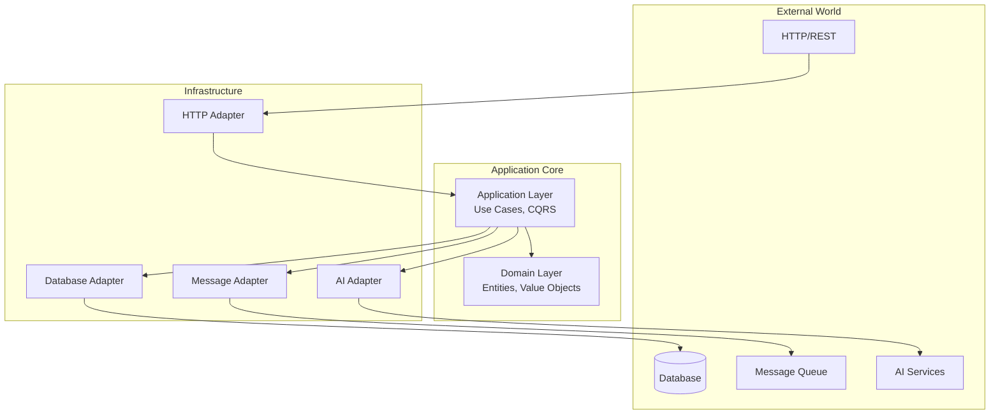
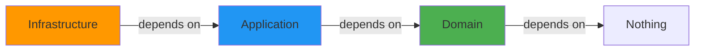
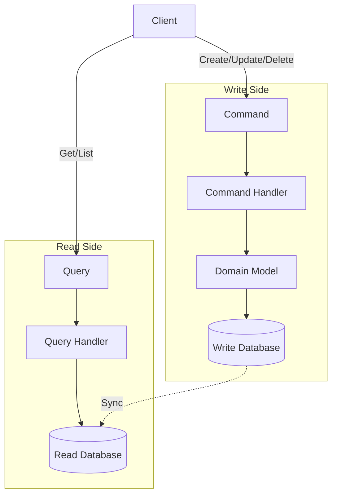

# Architecture Overview

Stratix is built on **Hexagonal Architecture** (Ports and Adapters) combined with **Domain-Driven Design** principles to create maintainable, testable, and scalable applications.

## Hexagonal Architecture

Also known as **Ports and Adapters**, this architecture pattern separates your business logic from external concerns.



### Core Principles

1. **Business Logic is Independent** - Domain code doesn't depend on frameworks or infrastructure
2. **Dependency Inversion** - Infrastructure depends on domain, not vice versa
3. **Testability** - Easy to test business logic in isolation
4. **Flexibility** - Swap implementations without changing business logic

## The Three Layers

### 1. Domain Layer (Core)

**Purpose**: Pure business logic

**Contains:**
- Entities and Aggregate Roots
- Value Objects
- Domain Services
- Domain Events
- Repository Interfaces

**Rules:**
- ❌ No dependencies on other layers
- ❌ No framework code
- ❌ No infrastructure concerns
- ✅ Pure TypeScript/JavaScript
- ✅ Business rules only

**Example:**
```typescript
// src/domain/entities/Order.ts
import { AggregateRoot, EntityId, DomainEvent } from '@stratix/core';

export class Order extends AggregateRoot<'Order'> {
  private items: OrderItem[] = [];
  private status: OrderStatus = OrderStatus.PENDING;

  addItem(item: OrderItem): void {
    if (this.status !== OrderStatus.PENDING) {
      throw new Error('Cannot add items to non-pending order');
    }
    
    this.items.push(item);
    this.addDomainEvent(new OrderItemAddedEvent(this.id, item));
  }

  calculateTotal(): Money {
    return this.items.reduce(
      (total, item) => total.add(item.price.multiply(item.quantity)),
      Money.USD(0)
    );
  }
}
```

### 2. Application Layer (Use Cases)

**Purpose**: Orchestrate domain objects to fulfill use cases

**Contains:**
- Commands and Command Handlers
- Queries and Query Handlers
- Application Services
- DTOs (Data Transfer Objects)

**Rules:**
- ✅ Depends on Domain layer
- ❌ No dependencies on Infrastructure
- ✅ Orchestrates domain objects
- ✅ Implements use cases

**Example:**
```typescript
// src/application/commands/CreateOrder.ts
import { Command } from '@stratix/core';

export class CreateOrderCommand implements Command {
  constructor(
    public readonly customerId: string,
    public readonly items: OrderItemDTO[]
  ) {}
}

// src/application/handlers/CreateOrderHandler.ts
import { CommandHandler, Result, Success, Failure } from '@stratix/core';

export class CreateOrderHandler 
  implements CommandHandler<CreateOrderCommand, Order> {
  
  constructor(
    private orderRepository: IOrderRepository,
    private productRepository: IProductRepository
  ) {}

  async handle(command: CreateOrderCommand): Promise<Result<Order>> {
    // Validate products exist
    for (const item of command.items) {
      const product = await this.productRepository.findById(item.productId);
      if (!product) {
        return Failure.create(new Error(`Product ${item.productId} not found`));
      }
    }

    // Create order (domain logic)
    const order = Order.create(
      EntityId.create<'Order'>(),
      command.customerId,
      command.items
    );

    // Persist
    await this.orderRepository.save(order);

    return Success.create(order);
  }
}
```

### 3. Infrastructure Layer (Technical Details)

**Purpose**: Implement technical details and external integrations

**Contains:**
- Repository Implementations
- HTTP Controllers
- Database Configurations
- External Service Clients
- Message Broker Integrations

**Rules:**
- ✅ Depends on Domain and Application layers
- ✅ Framework-specific code
- ✅ External integrations
- ✅ Technical implementations

**Example:**
```typescript
// src/infrastructure/repositories/PostgresOrderRepository.ts
import { IOrderRepository } from '../../domain/repositories/IOrderRepository';

export class PostgresOrderRepository implements IOrderRepository {
  constructor(private db: Database) {}

  async save(order: Order): Promise<void> {
    await this.db.transaction(async (trx) => {
      // Save order
      await trx('orders').insert({
        id: order.id,
        customer_id: order.customerId,
        status: order.status,
        total: order.calculateTotal().amount,
        created_at: order.createdAt
      });

      // Save order items
      for (const item of order.items) {
        await trx('order_items').insert({
          order_id: order.id,
          product_id: item.productId,
          quantity: item.quantity,
          price: item.price.amount
        });
      }
    });
  }

  async findById(id: EntityId<'Order'>): Promise<Order | null> {
    const row = await this.db('orders').where({ id }).first();
    return row ? this.toDomain(row) : null;
  }
}
```

## Dependency Flow



### Dependency Inversion Principle

The key is that **dependencies point inward**:

```typescript
// ✅ Good: Infrastructure depends on Domain
export class PostgresOrderRepository implements IOrderRepository {
  // IOrderRepository is defined in Domain layer
}

// ❌ Bad: Domain depends on Infrastructure
export class Order {
  async save() {
    await PostgresDatabase.query('INSERT...'); // Domain shouldn't know about Postgres
  }
}
```

## CQRS Integration

Stratix uses **CQRS** (Command Query Responsibility Segregation) to separate reads and writes:



### Commands (Write)

```typescript
// Modify state
const result = await commandBus.dispatch(
  new CreateOrderCommand(customerId, items)
);
```

### Queries (Read)

```typescript
// Read state
const result = await queryBus.execute(
  new GetOrderByIdQuery(orderId)
);
```

## Plugin Architecture

Stratix extends functionality through plugins:

```typescript
import { ApplicationBuilder } from '@stratix/runtime';

const app = await ApplicationBuilder.create()
  .useContainer(new AwilixContainer())
  .useLogger(new ConsoleLogger())
  
  // Infrastructure plugins
  .usePlugin(new PostgresPlugin({ /* config */ }))
  .usePlugin(new FastifyHTTPPlugin({ port: 3000 }))
  .usePlugin(new RabbitMQPlugin({ /* config */ }))
  
  // Domain modules
  .useModule(new OrdersModule())
  .useModule(new ProductsModule())
  
  .build();

await app.start();
```

## Bounded Contexts

Organize code by business domains (bounded contexts):

```
src/
├── modules/
│   ├── orders/              # Orders Bounded Context
│   │   ├── domain/
│   │   ├── application/
│   │   └── infrastructure/
│   │
│   ├── products/            # Products Bounded Context
│   │   ├── domain/
│   │   ├── application/
│   │   └── infrastructure/
│   │
│   └── customers/           # Customers Bounded Context
│       ├── domain/
│       ├── application/
│       └── infrastructure/
```

Each context is **portable** - works in monolith or microservice.

## Complete Example

### Domain Layer

```typescript
// domain/entities/Product.ts
export class Product extends AggregateRoot<'Product'> {
  constructor(
    id: EntityId<'Product'>,
    private name: string,
    private price: Money,
    createdAt: Date,
    updatedAt: Date
  ) {
    super(id, createdAt, updatedAt);
  }

  updatePrice(newPrice: Money): void {
    if (newPrice.amount <= 0) {
      throw new Error('Price must be positive');
    }
    this.price = newPrice;
    this.touch();
    this.addDomainEvent(new ProductPriceChangedEvent(this.id, newPrice));
  }
}

// domain/repositories/IProductRepository.ts
export interface IProductRepository {
  save(product: Product): Promise<void>;
  findById(id: EntityId<'Product'>): Promise<Product | null>;
  findAll(): Promise<Product[]>;
}
```

### Application Layer

```typescript
// application/commands/UpdateProductPrice.ts
export class UpdateProductPriceCommand implements Command {
  constructor(
    public readonly productId: string,
    public readonly newPrice: number
  ) {}
}

// application/handlers/UpdateProductPriceHandler.ts
export class UpdateProductPriceHandler 
  implements CommandHandler<UpdateProductPriceCommand, Product> {
  
  constructor(private productRepository: IProductRepository) {}

  async handle(command: UpdateProductPriceCommand): Promise<Result<Product>> {
    const product = await this.productRepository.findById(command.productId);
    
    if (!product) {
      return Failure.create(new Error('Product not found'));
    }

    product.updatePrice(Money.USD(command.newPrice));
    await this.productRepository.save(product);

    return Success.create(product);
  }
}
```

### Infrastructure Layer

```typescript
// infrastructure/http/ProductController.ts
export class ProductController {
  constructor(
    private commandBus: CommandBus,
    private queryBus: QueryBus
  ) {}

  async updatePrice(request: Request): Promise<Response> {
    const { id } = request.params;
    const { price } = request.body;

    const result = await this.commandBus.dispatch(
      new UpdateProductPriceCommand(id, price)
    );

    if (result.isFailure) {
      throw HttpErrorImpl.badRequest(result.error.message);
    }

    return { statusCode: 200, body: result.value };
  }
}

// infrastructure/repositories/PostgresProductRepository.ts
export class PostgresProductRepository implements IProductRepository {
  constructor(private db: Database) {}

  async save(product: Product): Promise<void> {
    await this.db('products')
      .insert({
        id: product.id,
        name: product.name,
        price: product.price.amount,
        updated_at: product.updatedAt
      })
      .onConflict('id')
      .merge();
  }

  async findById(id: EntityId<'Product'>): Promise<Product | null> {
    const row = await this.db('products').where({ id }).first();
    return row ? this.toDomain(row) : null;
  }
}
```

## Benefits

### 1. Testability

```typescript
// Test domain logic without infrastructure
describe('Product', () => {
  it('should update price', () => {
    const product = new Product(/* ... */);
    product.updatePrice(Money.USD(99.99));
    expect(product.price.amount).toBe(99.99);
  });
});

// Test application logic with mocks
describe('UpdateProductPriceHandler', () => {
  it('should update product price', async () => {
    const mockRepo = {
      findById: jest.fn().mockResolvedValue(product),
      save: jest.fn()
    };
    
    const handler = new UpdateProductPriceHandler(mockRepo);
    const result = await handler.handle(command);
    
    expect(result.isSuccess).toBe(true);
    expect(mockRepo.save).toHaveBeenCalled();
  });
});
```

### 2. Flexibility

```typescript
// Easy to swap implementations
// Development: In-memory
.usePlugin(new InMemoryDatabasePlugin())

// Production: PostgreSQL
.usePlugin(new PostgresPlugin({ /* config */ }))

// Domain code doesn't change!
```

### 3. Maintainability

- Clear separation of concerns
- Easy to locate code
- Changes are localized
- Reduced coupling

## Next Steps

- **[Domain Modeling](./domain-modeling)** - Learn about entities and value objects
- **[Bounded Contexts](./bounded-contexts)** - Modular architecture
- **[CQRS](./cqrs)** - Command Query Responsibility Segregation
- **[Result Pattern](./result-pattern)** - Error handling
- **[Dependency Injection](./dependency-injection)** - DI container
