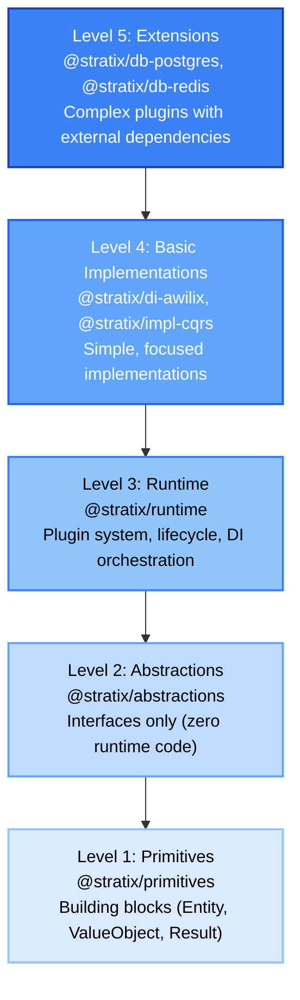
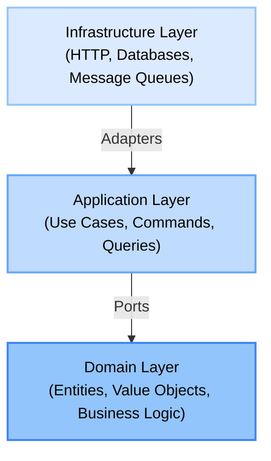

# Architecture

Stratix implements a **Plugin-First Hexagonal Architecture** with clear separation of concerns.

## Architecture Overview

Stratix is organized in 5 distinct layers:



## Hexagonal Architecture (Ports & Adapters)

Your application code follows the hexagonal pattern:



### Layer Responsibilities

#### 1. Domain Layer

**Pure business logic**. No dependencies on infrastructure.

```typescript
// src/domain/entities/Order.ts
export class Order extends AggregateRoot<'Order'> {
  placeOrder(): void {
    if (this._items.length === 0) {
      throw new Error('Cannot place empty order');
    }
    this._status = OrderStatus.Placed;
    this.record(new OrderPlacedEvent(this.id));
    this.touch();
  }
}
```

Contains:
- **Entities**: Objects with identity
- **Value Objects**: Immutable values
- **Domain Events**: What happened in the domain
- **Repository Interfaces**: Persistence contracts
- **Domain Services**: Multi-entity operations

#### 2. Application Layer

**Use case orchestration**. Coordinates domain objects and infrastructure.

```typescript
// src/application/commands/PlaceOrder.ts
export class PlaceOrderHandler implements CommandHandler<PlaceOrder, Result<PlaceOrderOutput>> {
  constructor(
    private readonly orderRepository: OrderRepository,
    private readonly eventBus: EventBus
  ) {}

  async handle(command: PlaceOrder): Promise<Result<PlaceOrderOutput>> {
    const order = await this.orderRepository.findById(command.data.orderId);

    order.placeOrder();

    await this.orderRepository.save(order);

    const events = order.pullDomainEvents();
    await this.eventBus.publish(events);

    return Success.create({ orderId: order.id.toString() });
  }
}
```

Contains:
- **Commands**: State-changing operations
- **Queries**: Read-only operations
- **Command/Query Handlers**: Use case implementation
- **Application Services**: Cross-cutting concerns

#### 3. Infrastructure Layer

**Technical implementation**. Adapters to external systems.

```typescript
// src/infrastructure/persistence/PostgresOrderRepository.ts
export class PostgresOrderRepository implements OrderRepository {
  constructor(private readonly connection: PostgresConnection) {}

  async findById(id: OrderId): Promise<Order | null> {
    const row = await this.connection.query(
      'SELECT * FROM orders WHERE id = $1',
      [id.toString()]
    );

    return row ? this.toDomain(row) : null;
  }
}
```

Contains:
- **Repository Implementations**: Database access
- **HTTP Controllers**: API endpoints
- **Message Queue Consumers**: Event handlers
- **External Service Clients**: Third-party integrations

## Dependency Rule

**Dependencies point inward**. Inner layers never depend on outer layers.

```
 Allowed:
Infrastructure → Application → Domain
Application → Domain

 Not Allowed:
Domain → Application
Domain → Infrastructure
Application → Infrastructure
```

### Example: Correct Dependencies

```typescript
//  Good: Application depends on Domain interface
export class CreateUserHandler {
  constructor(private readonly userRepository: UserRepository) {}
  //                                          ^^^^^^^^^^^^^^
  //                                          Domain interface
}

//  Good: Infrastructure implements Domain interface
export class PostgresUserRepository implements UserRepository {
  //                                  ^^^^^^^^^^^^^^
  //                                  From domain layer
}
```

### Example: Incorrect Dependencies

```typescript
//  Bad: Domain depends on Infrastructure
export class User {
  constructor(private readonly db: PostgresConnection) {}
  //                                ^^^^^^^^^^^^^^^^^^
  //                                Infrastructure detail
}

//  Bad: Domain depends on Application
export class Order {
  constructor(private readonly commandBus: CommandBus) {}
  //                                      ^^^^^^^^^^
  //                                      Application service
}
```

## Plugin Architecture

Stratix uses a plugin system for extensibility:

```typescript
const app = await ApplicationBuilder.create()
  .useContainer(new AwilixContainer())
  .useLogger(new ConsoleLogger())
  .usePlugin(new PostgresPlugin(), {
    connectionString: process.env.DATABASE_URL
  })
  .usePlugin(new RabbitMQPlugin(), {
    url: process.env.RABBITMQ_URL
  })
  .build();
```

### Plugin Lifecycle

1. **Initialize**: Set up configuration and register services
2. **Start**: Connect to external resources
3. **Running**: Normal operation
4. **Stop**: Graceful shutdown

```typescript
export class MyPlugin implements Plugin {
  readonly metadata: PluginMetadata = {
    name: 'my-plugin',
    version: '1.0.0',
    description: 'My custom plugin',
    dependencies: []
  };

  async initialize(context: PluginContext): Promise<void> {
    // Register services in DI container
  }

  async start(): Promise<void> {
    // Connect to external systems
  }

  async stop(): Promise<void> {
    // Clean up resources
  }

  async healthCheck(): Promise<HealthCheckResult> {
    // Report health status
  }
}
```

## Benefits of This Architecture

### 1. Testability

Test domain logic without infrastructure:

```typescript
describe('Order', () => {
  it('should not place empty order', () => {
    const order = Order.create([]);

    expect(() => order.placeOrder()).toThrow('Cannot place empty order');
  });
});
```

### 2. Flexibility

Swap implementations without changing business logic:

```typescript
// Development
.usePlugin(new InMemoryPlugin())

// Production
.usePlugin(new PostgresPlugin())
```

### 3. Maintainability

Clear boundaries make code easier to understand and modify.

### 4. Team Scalability

Different teams can work on different layers independently.

## Next Steps

- [Plugins](./plugins.md) - Learn about the plugin system
- [Bounded Contexts](./bounded-contexts.md) - Portable domain modules
- [Entities & Aggregates](./entities.md) - Domain modeling
- [Value Objects](./value-objects.md) - Immutable domain concepts
- [Repository Pattern](./repository-pattern.md) - Data access abstraction
- [Result Pattern](./result-pattern.md) - Explicit error handling
- [CQRS](./cqrs.md) - Commands and queries pattern
