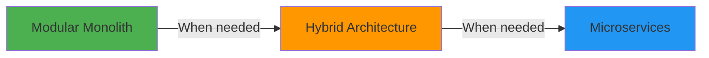

# Bounded Contexts

One of Stratix's most powerful features is **Bounded Contexts** - self-contained domain modules that work seamlessly in both monolithic and microservices architectures.

> [!IMPORTANT]
> **The Modular Advantage**
> 
> Start with a modular monolith and migrate to microservices **only when necessary**. Stratix makes this transition seamless because bounded contexts are portable by design.

## What are Bounded Contexts?

A **Bounded Context** is a self-contained module that encapsulates:
- Domain logic (entities, value objects, domain services)
- Application logic (commands, queries, handlers)
- Infrastructure (repositories, external integrations)
- Clear boundaries and interfaces

### Key Benefits

✅ **Start Simple** - Build as a monolith, deploy as one application  
✅ **Scale Gradually** - Extract contexts to microservices when needed  
✅ **Team Autonomy** - Each team owns a bounded context  
✅ **Clear Boundaries** - No accidental coupling between domains  
✅ **Portable** - Same code works in monolith or microservice  

## The Migration Path



### Phase 1: Modular Monolith (Start Here)

**Perfect for:**
- New projects
- Small to medium teams
- Rapid development
- Uncertain scaling needs

**Architecture:**
```
Single Application
├── Products Context
├── Orders Context
├── Customers Context
└── Inventory Context

All contexts run in the same process
```

**Benefits:**
- ✅ Simple deployment
- ✅ Shared database transactions
- ✅ Fast inter-context communication
- ✅ Easy debugging
- ✅ Lower operational complexity

### Phase 2: Hybrid Architecture (Scale Strategically)

**Perfect for:**
- Growing applications
- Specific scaling needs
- Team growth

**Architecture:**
```
Main Application (Monolith)
├── Products Context
├── Orders Context
└── Customers Context

Separate Service (Microservice)
└── Inventory Context (high load)
```

**Benefits:**
- ✅ Scale only what needs scaling
- ✅ Gradual migration
- ✅ Lower risk
- ✅ Maintain monolith benefits where possible

### Phase 3: Microservices (When Necessary)

**Perfect for:**
- Large teams
- High scale requirements
- Independent deployment needs

**Architecture:**
```
Products Service
Orders Service
Customers Service
Inventory Service

Each context is a separate service
```

**Benefits:**
- ✅ Independent scaling
- ✅ Independent deployment
- ✅ Technology diversity
- ✅ Team autonomy

## Context Module Interface

Stratix provides the `ContextModule` interface for defining bounded contexts:

```typescript
import { ContextModule, ModuleMetadata, ModuleContext } from '@stratix/core';

export class ProductsModule implements ContextModule {
  readonly metadata: ModuleMetadata = {
    name: 'products-context',
    version: '1.0.0',
    description: 'Products Bounded Context',
    requiredPlugins: ['postgres', 'rabbitmq'],
    requiredModules: [] // Dependencies on other contexts
  };

  readonly contextName = 'Products';

  async initialize(context: ModuleContext): Promise<void> {
    // Register repositories, services, etc.
    const repository = new PostgresProductRepository(context.container);
    context.container.register('productRepository', () => repository);
  }

  getCommands(): CommandDefinition[] {
    return [
      {
        name: 'CreateProduct',
        commandType: CreateProductCommand,
        handler: new CreateProductHandler(/* dependencies */)
      }
    ];
  }

  getQueries(): QueryDefinition[] {
    return [
      {
        name: 'GetProductById',
        queryType: GetProductByIdQuery,
        handler: new GetProductByIdHandler(/* dependencies */)
      }
    ];
  }

  getEventHandlers(): EventHandlerDefinition[] {
    return [
      {
        eventType: 'ProductCreated',
        handler: new ProductCreatedHandler(/* dependencies */)
      }
    ];
  }
}
```

## Example: Modular Monolith

### Project Structure

```
my-ecommerce/
├── src/
│   ├── modules/
│   │   ├── products/           # Products Context
│   │   │   ├── domain/
│   │   │   ├── application/
│   │   │   ├── infrastructure/
│   │   │   └── ProductsModule.ts
│   │   │
│   │   ├── orders/             # Orders Context
│   │   │   ├── domain/
│   │   │   ├── application/
│   │   │   ├── infrastructure/
│   │   │   └── OrdersModule.ts
│   │   │
│   │   └── customers/          # Customers Context
│   │       ├── domain/
│   │       ├── application/
│   │       ├── infrastructure/
│   │       └── CustomersModule.ts
│   │
│   └── index.ts                # Application entry point
```

### Application Setup (Monolith)

```typescript
// src/index.ts
import { ApplicationBuilder } from '@stratix/runtime';
import { ProductsModule } from './modules/products/ProductsModule';
import { OrdersModule } from './modules/orders/OrdersModule';
import { CustomersModule } from './modules/customers/CustomersModule';

const app = await ApplicationBuilder.create()
  .useContainer(new AwilixContainer())
  .useLogger(new ConsoleLogger())
  
  // Infrastructure plugins
  .usePlugin(new PostgresPlugin({ /* config */ }))
  .usePlugin(new FastifyHTTPPlugin({ port: 3000 }))
  
  // Bounded contexts - all in one application
  .useModule(new ProductsModule())
  .useModule(new OrdersModule())
  .useModule(new CustomersModule())
  
  .build();

await app.start();
// All contexts running in the same process! 🚀
```

## Migrating to Microservices

### Step 1: Identify the Context to Extract

Let's say `OrdersModule` needs independent scaling:

```typescript
// Before: Monolith with all contexts
.useModule(new ProductsModule())
.useModule(new OrdersModule())      // ← Extract this
.useModule(new CustomersModule())
```

### Step 2: Create a Separate Service

**orders-service/src/index.ts:**
```typescript
import { ApplicationBuilder } from '@stratix/runtime';
import { OrdersModule } from './modules/orders/OrdersModule';

// Orders microservice - SAME MODULE CODE!
const app = await ApplicationBuilder.create()
  .useContainer(new AwilixContainer())
  .useLogger(new ConsoleLogger())
  
  .usePlugin(new PostgresPlugin({ /* config */ }))
  .usePlugin(new FastifyHTTPPlugin({ port: 3001 }))
  .usePlugin(new RabbitMQPlugin({ /* config */ }))
  
  // Same OrdersModule, different service!
  .useModule(new OrdersModule())
  
  .build();

await app.start();
```

### Step 3: Update the Main Application

**main-app/src/index.ts:**
```typescript
const app = await ApplicationBuilder.create()
  .useContainer(new AwilixContainer())
  .useLogger(new ConsoleLogger())
  
  .usePlugin(new PostgresPlugin({ /* config */ }))
  .usePlugin(new FastifyHTTPPlugin({ port: 3000 }))
  .usePlugin(new RabbitMQPlugin({ /* config */ }))
  
  // Remove OrdersModule from here
  .useModule(new ProductsModule())
  .useModule(new CustomersModule())
  
  .build();

await app.start();
```

### Step 4: Inter-Service Communication

Use events for communication between services:

```typescript
// In ProductsModule (main app)
class ProductCreatedHandler implements EventHandler<ProductCreatedEvent> {
  constructor(private eventBus: EventBus) {}

  async handle(event: ProductCreatedEvent): Promise<void> {
    // Publish event to message broker
    await this.eventBus.publish(event);
    // OrdersService will receive this event via RabbitMQ
  }
}

// In OrdersModule (separate service)
class ProductCreatedHandler implements EventHandler<ProductCreatedEvent> {
  async handle(event: ProductCreatedEvent): Promise<void> {
    // React to product creation
    console.log('Product created:', event.productId);
  }
}
```

## Context Dependencies

### Declaring Dependencies

```typescript
export class OrdersModule implements ContextModule {
  readonly metadata: ModuleMetadata = {
    name: 'orders-context',
    version: '1.0.0',
    
    // Require these plugins
    requiredPlugins: ['postgres', 'rabbitmq'],
    
    // Depend on these contexts (in monolith)
    requiredModules: ['products-context', 'customers-context']
  };
}
```

### Dependency Resolution

Stratix automatically:
- ✅ Initializes contexts in dependency order
- ✅ Validates all dependencies are present
- ✅ Detects circular dependencies
- ✅ Provides clear error messages

## Communication Patterns

### In Monolith: Direct Communication

```typescript
// Direct method calls - fast and simple
class CreateOrderHandler implements CommandHandler<CreateOrderCommand> {
  constructor(
    private productRepository: IProductRepository,
    private customerRepository: ICustomerRepository
  ) {}

  async handle(command: CreateOrderCommand): Promise<Result<Order>> {
    // Direct repository access - same process
    const product = await this.productRepository.findById(command.productId);
    const customer = await this.customerRepository.findById(command.customerId);
    
    // Create order
    const order = new Order(/* ... */);
    return Success.create(order);
  }
}
```

### In Microservices: Event-Driven Communication

```typescript
// Event-driven - decoupled services
class CreateOrderHandler implements CommandHandler<CreateOrderCommand> {
  constructor(
    private eventBus: EventBus,
    private httpClient: HttpClient
  ) {}

  async handle(command: CreateOrderCommand): Promise<Result<Order>> {
    // HTTP call to Products service
    const product = await this.httpClient.get(
      `http://products-service/api/products/${command.productId}`
    );
    
    // Create order
    const order = new Order(/* ... */);
    
    // Publish event
    await this.eventBus.publish(new OrderCreatedEvent(order));
    
    return Success.create(order);
  }
}
```

## Best Practices

### 1. Start with a Modular Monolith

```typescript
// ✅ Good: Start simple
const app = await ApplicationBuilder.create()
  .useModule(new ProductsModule())
  .useModule(new OrdersModule())
  .useModule(new CustomersModule())
  .build();
```

### 2. Design for Portability

```typescript
// ✅ Good: Use interfaces, not concrete implementations
class OrdersModule {
  getCommands() {
    return [{
      handler: new CreateOrderHandler(
        this.container.resolve('productRepository'), // Interface
        this.container.resolve('customerRepository')  // Interface
      )
    }];
  }
}

// ❌ Bad: Hard-coded dependencies
class OrdersModule {
  getCommands() {
    return [{
      handler: new CreateOrderHandler(
        new PostgresProductRepository(), // Concrete class
        new PostgresCustomerRepository()  // Concrete class
      )
    }];
  }
}
```

### 3. Use Events for Cross-Context Communication

```typescript
// ✅ Good: Event-driven (works in monolith and microservices)
await this.eventBus.publish(new ProductCreatedEvent(product));

// ⚠️ Acceptable in monolith, breaks in microservices
const order = await this.orderRepository.findByProductId(productId);
```

### 4. Keep Contexts Independent

Each bounded context should have its own database schema and tables. Avoid sharing database tables between contexts, as this creates tight coupling and makes contexts harder to evolve independently.

## Real-World Example

### Scenario: E-Commerce Platform

**Start (Day 1):** Modular Monolith
```
Single Application (1 server)
├── Products Context
├── Orders Context
├── Customers Context
└── Inventory Context

Cost: $50/month
Complexity: Low
Team: 3 developers
```

**Growth (Month 6):** Hybrid Architecture
```
Main Application (1 server)
├── Products Context
├── Orders Context
└── Customers Context

Inventory Service (2 servers - high load)
└── Inventory Context

Cost: $200/month
Complexity: Medium
Team: 6 developers
```

**Scale (Year 2):** Microservices
```
Products Service (2 servers)
Orders Service (3 servers - high load)
Customers Service (1 server)
Inventory Service (2 servers)

Cost: $800/month
Complexity: High
Team: 15 developers (3-4 per service)
```

## Migration Checklist

When extracting a context to a microservice:

- [ ] Identify context boundaries
- [ ] Review context dependencies
- [ ] Set up message broker (RabbitMQ)
- [ ] Replace direct calls with events/HTTP
- [ ] Set up separate database
- [ ] Configure deployment pipeline
- [ ] Update monitoring and logging
- [ ] Test inter-service communication
- [ ] Gradual rollout (canary deployment)

## Next Steps

- **[Architecture Overview](./architecture-overview)** - Hexagonal architecture
- **[Domain Modeling](./domain-modeling)** - Domain entities
- **[CQRS](./cqrs)** - Command and query patterns
- **[Plugin System](../plugins/plugin-architecture)** - Plugin architecture
