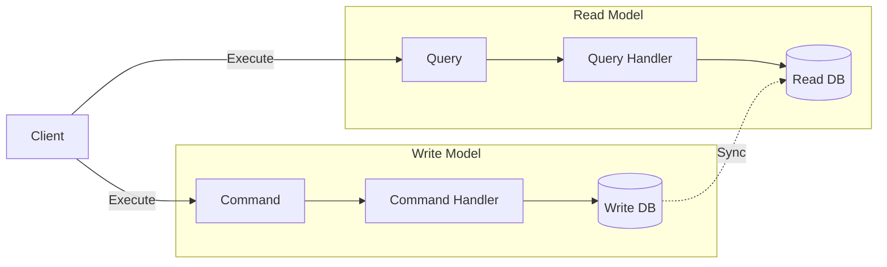

# CQRS

**CQRS** (Command Query Responsibility Segregation) is a pattern that separates read and write operations into different models.

## The Principle

> **Commands** change state. **Queries** return state. Never do both.



## Commands (Write Operations)

Commands represent **intentions to change state**.

### Characteristics

- ✅ Imperative names (CreateProduct, UpdateOrder)
- ✅ Contain data needed for the operation
- ✅ Return `Result<T>` (success or failure)
- ✅ May fail (validation, business rules)

### Example

```typescript
import { Command } from '@stratix/core';

export class CreateProductCommand implements Command {
  constructor(
    public readonly name: string,
    public readonly price: number,
    public readonly stock: number
  ) {}
}
```

### Command Handler

```typescript
import { CommandHandler, Result, Success, Failure } from '@stratix/core';

export class CreateProductHandler 
  implements CommandHandler<CreateProductCommand, Product> {
  
  constructor(
    private productRepository: IProductRepository,
    private eventBus: EventBus
  ) {}

  async handle(command: CreateProductCommand): Promise<Result<Product>> {
    // Validation
    if (command.price <= 0) {
      return Failure.create(new Error('Price must be positive'));
    }

    // Create entity
    const product = new Product(
      EntityId.create<'Product'>(),
      command.name,
      Money.USD(command.price),
      command.stock,
      new Date(),
      new Date()
    );

    // Persist
    await this.productRepository.save(product);

    // Publish events
    const events = product.getDomainEvents();
    for (const event of events) {
      await this.eventBus.publish(event);
    }

    return Success.create(product);
  }
}
```

### Dispatching Commands

```typescript
import { CommandBus } from '@stratix/core';

// Dispatch command
const result = await commandBus.dispatch(
  new CreateProductCommand('Laptop', 999.99, 10)
);

if (result.isSuccess) {
  console.log('Product created:', result.value);
} else {
  console.error('Failed:', result.error.message);
}
```

## Queries (Read Operations)

Queries represent **requests for data**.

### Characteristics

- ✅ Descriptive names (GetProductById, ListOrders)
- ✅ Contain filter/search criteria
- ✅ Return `Result<T>` with data
- ✅ Never modify state

### Example

```typescript
import { Query } from '@stratix/core';

export class GetProductByIdQuery implements Query<Product> {
  constructor(public readonly productId: string) {}
}

export class ListProductsQuery implements Query<Product[]> {
  constructor(
    public readonly page: number = 1,
    public readonly limit: number = 10,
    public readonly category?: string
  ) {}
}
```

### Query Handler

```typescript
import { QueryHandler, Result, Success, Failure } from '@stratix/core';

export class GetProductByIdHandler 
  implements QueryHandler<GetProductByIdQuery, Product> {
  
  constructor(private productRepository: IProductRepository) {}

  async handle(query: GetProductByIdQuery): Promise<Result<Product>> {
    const product = await this.productRepository.findById(query.productId);

    if (!product) {
      return Failure.create(new Error('Product not found'));
    }

    return Success.create(product);
  }
}

export class ListProductsHandler 
  implements QueryHandler<ListProductsQuery, Product[]> {
  
  constructor(private productRepository: IProductRepository) {}

  async handle(query: ListProductsQuery): Promise<Result<Product[]>> {
    const products = await this.productRepository.findAll({
      page: query.page,
      limit: query.limit,
      category: query.category
    });

    return Success.create(products);
  }
}
```

### Executing Queries

```typescript
import { QueryBus } from '@stratix/core';

// Execute query
const result = await queryBus.execute(
  new GetProductByIdQuery('product-123')
);

if (result.isSuccess) {
  console.log('Product:', result.value);
}

// List query
const listResult = await queryBus.execute(
  new ListProductsQuery(1, 20, 'electronics')
);
```

## Command Bus

The **Command Bus** dispatches commands to their handlers.

### Setup

```typescript
import { InMemoryCommandBus } from '@stratix/core';

const commandBus = new InMemoryCommandBus();

// Register handlers
commandBus.register(
  CreateProductCommand,
  new CreateProductHandler(productRepository, eventBus)
);

commandBus.register(
  UpdateProductCommand,
  new UpdateProductHandler(productRepository)
);
```

### Usage

```typescript
// Dispatch command
const result = await commandBus.dispatch(
  new CreateProductCommand('Laptop', 999.99, 10)
);
```

## Query Bus

The **Query Bus** executes queries and returns results.

### Setup

```typescript
import { InMemoryQueryBus } from '@stratix/core';

const queryBus = new InMemoryQueryBus();

// Register handlers
queryBus.register(
  GetProductByIdQuery,
  new GetProductByIdHandler(productRepository)
);

queryBus.register(
  ListProductsQuery,
  new ListProductsHandler(productRepository)
);
```

### Usage

```typescript
// Execute query
const result = await queryBus.execute(
  new GetProductByIdQuery('product-123')
);
```

## HTTP Integration

### Commands in Controllers

```typescript
import { FastifyHTTPPlugin, HttpErrorImpl } from '@stratix/http-fastify';

httpPlugin.post('/products', async (request) => {
  const { name, price, stock } = request.body;

  const result = await commandBus.dispatch(
    new CreateProductCommand(name, price, stock)
  );

  if (result.isFailure) {
    throw HttpErrorImpl.badRequest(result.error.message);
  }

  return { statusCode: 201, body: result.value };
});

httpPlugin.put('/products/:id', async (request) => {
  const { id } = request.params;
  const { name, price } = request.body;

  const result = await commandBus.dispatch(
    new UpdateProductCommand(id, name, price)
  );

  if (result.isFailure) {
    throw HttpErrorImpl.badRequest(result.error.message);
  }

  return { body: result.value };
});
```

### Queries in Controllers

```typescript
httpPlugin.get('/products/:id', async (request) => {
  const { id } = request.params;

  const result = await queryBus.execute(
    new GetProductByIdQuery(id)
  );

  if (result.isFailure) {
    throw HttpErrorImpl.notFound('Product not found');
  }

  return { body: result.value };
});

httpPlugin.get('/products', async (request) => {
  const { page, limit, category } = request.query;

  const result = await queryBus.execute(
    new ListProductsQuery(
      parseInt(page || '1'),
      parseInt(limit || '10'),
      category
    )
  );

  return { body: result.value };
});
```

## Event Bus

The **Event Bus** publishes and subscribes to domain events.

### Publishing Events

```typescript
import { InMemoryEventBus } from '@stratix/core';

const eventBus = new InMemoryEventBus();

// Publish event
await eventBus.publish(
  new ProductCreatedEvent(product.id, product.name)
);
```

### Subscribing to Events

```typescript
// Register event handler
eventBus.subscribe(
  'ProductCreated',
  new ProductCreatedHandler(emailService)
);

// Event handler
export class ProductCreatedHandler 
  implements EventHandler<ProductCreatedEvent> {
  
  constructor(private emailService: EmailService) {}

  async handle(event: ProductCreatedEvent): Promise<void> {
    await this.emailService.sendProductCreatedEmail(event.productId);
  }
}
```

## Advanced Patterns

### Read Model Optimization

```typescript
// Separate read model for queries
export class ProductReadModel {
  constructor(
    public readonly id: string,
    public readonly name: string,
    public readonly price: number,
    public readonly category: string,
    public readonly inStock: boolean
  ) {}
}

export class ListProductsHandler 
  implements QueryHandler<ListProductsQuery, ProductReadModel[]> {
  
  constructor(private db: Database) {}

  async handle(query: ListProductsQuery): Promise<Result<ProductReadModel[]>> {
    // Optimized query for reads
    const products = await this.db('products_read_model')
      .select('*')
      .where('category', query.category)
      .limit(query.limit)
      .offset((query.page - 1) * query.limit);

    return Success.create(products);
  }
}
```

### Command Validation

```typescript
export class CreateProductHandler {
  async handle(command: CreateProductCommand): Promise<Result<Product>> {
    // Validate command
    const validation = this.validate(command);
    if (validation.isFailure) {
      return validation;
    }

    // Process command
    // ...
  }

  private validate(command: CreateProductCommand): Result<void> {
    if (!command.name || command.name.trim().length === 0) {
      return Failure.create(new Error('Name is required'));
    }

    if (command.price <= 0) {
      return Failure.create(new Error('Price must be positive'));
    }

    if (command.stock < 0) {
      return Failure.create(new Error('Stock cannot be negative'));
    }

    return Success.create(undefined);
  }
}
```

## Best Practices

### 1. Commands Should Be Imperative

```typescript
// ✅ Good: Imperative
CreateProductCommand
UpdateOrderCommand
DeleteCustomerCommand

// ❌ Bad: Not imperative
ProductCommand
OrderCommand
```

### 2. Queries Should Be Descriptive

```typescript
// ✅ Good: Descriptive
GetProductByIdQuery
ListActiveOrdersQuery
FindCustomersByEmailQuery

// ❌ Bad: Not descriptive
ProductQuery
OrdersQuery
```

### 3. Never Modify State in Queries

```typescript
// ✅ Good: Read-only
export class GetProductHandler {
  async handle(query: GetProductByIdQuery): Promise<Result<Product>> {
    return await this.repository.findById(query.id);
  }
}

// ❌ Bad: Modifying state
export class GetProductHandler {
  async handle(query: GetProductByIdQuery): Promise<Result<Product>> {
    const product = await this.repository.findById(query.id);
    product.incrementViewCount(); // Don't modify in queries!
    await this.repository.save(product);
    return product;
  }
}
```

### 4. Use Result Pattern

```typescript
// ✅ Good: Returns Result
async handle(command: CreateProductCommand): Promise<Result<Product>> {
  if (command.price <= 0) {
    return Failure.create(new Error('Invalid price'));
  }
  return Success.create(product);
}

// ❌ Bad: Throws exceptions
async handle(command: CreateProductCommand): Promise<Product> {
  if (command.price <= 0) {
    throw new Error('Invalid price');
  }
  return product;
}
```

## When to Use CQRS

### Use CQRS When:

- ✅ Different read and write performance requirements
- ✅ Complex business logic on writes
- ✅ Simple, optimized reads
- ✅ Event-driven architecture
- ✅ Scalability is important

### Don't Use CQRS When:

- ❌ Simple CRUD operations
- ❌ Small applications
- ❌ Reads and writes are similar
- ❌ Team is unfamiliar with the pattern

## Next Steps

- **[Domain Modeling](./domain-modeling)** - Entities and value objects
- **[Result Pattern](./result-pattern)** - Error handling
- **[Bounded Contexts](./bounded-contexts)** - Modular architecture
