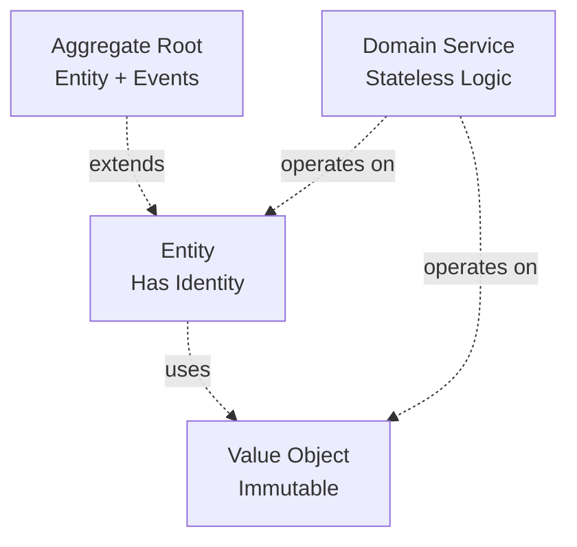

# Domain Modeling

Domain modeling is the heart of Domain-Driven Design. Stratix provides powerful primitives to model your business domain accurately.

## Core Building Blocks



## Entity

An **Entity** is an object with a unique identity that persists over time.

### Characteristics

- ✅ Has a unique identifier
- ✅ Mutable (can change over time)
- ✅ Identity-based equality
- ✅ Has lifecycle (created, updated, deleted)

### Example

```typescript
import { Entity, EntityId } from '@stratix/core';

type UserId = EntityId<'User'>;

export class User extends Entity<'User'> {
  constructor(
    id: UserId,
    private email: string,
    private name: string,
    private isActive: boolean,
    createdAt: Date,
    updatedAt: Date
  ) {
    super(id, createdAt, updatedAt);
  }

  // Getters
  get Email(): string {
    return this.email;
  }

  get Name(): string {
    return this.name;
  }

  get IsActive(): boolean {
    return this.isActive;
  }

  // Business methods
  changeName(newName: string): void {
    if (!newName || newName.trim().length === 0) {
      throw new Error('Name cannot be empty');
    }
    this.name = newName;
    this.touch(); // Updates updatedAt timestamp
  }

  deactivate(): void {
    if (!this.isActive) {
      throw new Error('User is already inactive');
    }
    this.isActive = false;
    this.touch();
  }

  activate(): void {
    if (this.isActive) {
      throw new Error('User is already active');
    }
    this.isActive = true;
    this.touch();
  }
}

// Usage
const userId = EntityId.create<'User'>();
const user = new User(
  userId,
  'john@example.com',
  'John Doe',
  true,
  new Date(),
  new Date()
);

user.changeName('John Smith');
console.log(user.Name); // "John Smith"
```

### Entity Equality

Entities are equal if they have the same ID:

```typescript
const user1 = new User(userId, 'john@example.com', 'John', true, now, now);
const user2 = new User(userId, 'jane@example.com', 'Jane', false, now, now);

console.log(user1.equals(user2)); // true (same ID)
```

## Aggregate Root

An **Aggregate Root** is an entity that serves as the entry point to an aggregate - a cluster of related objects treated as a single unit.

### Characteristics

- ✅ All characteristics of Entity
- ✅ Can emit domain events
- ✅ Enforces invariants across the aggregate
- ✅ Controls access to child entities

### Example

```typescript
import { AggregateRoot, EntityId } from '@stratix/core';

type OrderId = EntityId<'Order'>;

export class Order extends AggregateRoot<'Order'> {
  private items: OrderItem[] = [];
  private status: OrderStatus = OrderStatus.PENDING;

  constructor(
    id: OrderId,
    private customerId: string,
    createdAt: Date,
    updatedAt: Date
  ) {
    super(id, createdAt, updatedAt);
  }

  // Add item to order
  addItem(productId: string, quantity: number, price: Money): void {
    // Enforce invariant: can only add items to pending orders
    if (this.status !== OrderStatus.PENDING) {
      throw new Error('Cannot add items to non-pending order');
    }

    const item = new OrderItem(productId, quantity, price);
    this.items.push(item);

    // Emit domain event
    this.addDomainEvent(new OrderItemAddedEvent(this.id, productId, quantity));
    this.touch();
  }

  // Remove item from order
  removeItem(productId: string): void {
    if (this.status !== OrderStatus.PENDING) {
      throw new Error('Cannot remove items from non-pending order');
    }

    const index = this.items.findIndex(item => item.productId === productId);
    if (index === -1) {
      throw new Error('Item not found in order');
    }

    this.items.splice(index, 1);
    this.addDomainEvent(new OrderItemRemovedEvent(this.id, productId));
    this.touch();
  }

  // Confirm order
  confirm(): void {
    // Enforce invariant: order must have items
    if (this.items.length === 0) {
      throw new Error('Cannot confirm empty order');
    }

    // Enforce invariant: order must be pending
    if (this.status !== OrderStatus.PENDING) {
      throw new Error('Only pending orders can be confirmed');
    }

    this.status = OrderStatus.CONFIRMED;
    this.addDomainEvent(new OrderConfirmedEvent(this.id, this.calculateTotal()));
    this.touch();
  }

  // Calculate total
  calculateTotal(): Money {
    return this.items.reduce(
      (total, item) => total.add(item.price.multiply(item.quantity)),
      Money.USD(0)
    );
  }

  // Getters
  get Items(): readonly OrderItem[] {
    return this.items; // Return readonly to prevent external modification
  }

  get Status(): OrderStatus {
    return this.status;
  }

  get CustomerId(): string {
    return this.customerId;
  }
}

// Child entity (not an aggregate root)
class OrderItem {
  constructor(
    public readonly productId: string,
    public readonly quantity: number,
    public readonly price: Money
  ) {}
}

enum OrderStatus {
  PENDING = 'PENDING',
  CONFIRMED = 'CONFIRMED',
  SHIPPED = 'SHIPPED',
  DELIVERED = 'DELIVERED',
  CANCELLED = 'CANCELLED'
}
```

### Domain Events

```typescript
// Retrieve and clear domain events
const events = order.getDomainEvents();
order.clearDomainEvents();

// Publish events
for (const event of events) {
  await eventBus.publish(event);
}
```

## Value Object

A **Value Object** is an immutable object defined by its attributes, not its identity.

### Characteristics

- ✅ Immutable (cannot change after creation)
- ✅ Value-based equality
- ✅ No identity
- ✅ Self-validating

### Example

```typescript
import { ValueObject, Result, Success, Failure } from '@stratix/core';

interface EmailProps {
  value: string;
}

export class Email extends ValueObject<EmailProps> {
  private constructor(props: EmailProps) {
    super(props);
  }

  static create(email: string): Result<Email> {
    // Validation
    if (!email || email.trim().length === 0) {
      return Failure.create(new Error('Email cannot be empty'));
    }

    const emailRegex = /^[^\s@]+@[^\s@]+\.[^\s@]+$/;
    if (!emailRegex.test(email)) {
      return Failure.create(new Error('Invalid email format'));
    }

    return Success.create(new Email({ value: email.toLowerCase() }));
  }

  get value(): string {
    return this.props.value;
  }

  get domain(): string {
    return this.props.value.split('@')[1];
  }
}

// Usage
const emailResult = Email.create('john@example.com');

if (emailResult.isSuccess) {
  const email = emailResult.value;
  console.log(email.value);  // "john@example.com"
  console.log(email.domain); // "example.com"
}
```

### Built-in Value Objects

Stratix provides 11 built-in value objects:

```typescript
import {
  Money,
  Currency,
  Email,
  URL,
  PhoneNumber,
  UUID,
  DateRange,
  Percentage,
  Address
} from '@stratix/core';

// Money
const price = Money.USD(99.99);
const discounted = price.multiply(0.8);
console.log(discounted.format()); // "$79.99"

// Email
const email = Email.create('user@example.com');

// Phone Number
const phoneResult = PhoneNumber.create('+14155552671');
if (phoneResult.isSuccess) {
  console.log(phoneResult.value.format()); // "+1 (415) 555-2671"
}

// Date Range
const rangeResult = DateRange.create(
  new Date('2024-01-01'),
  new Date('2024-12-31')
);

// Percentage
const discount = Percentage.fromPercentage(15); // 15%

// Address
const addressResult = Address.create({
  street: '123 Main St',
  city: 'San Francisco',
  state: 'CA',
  postalCode: '94102',
  country: 'US'
});
```

### Value Object Equality

Value objects are equal if their values are equal:

```typescript
const email1 = Email.create('john@example.com').value;
const email2 = Email.create('john@example.com').value;

console.log(email1.equals(email2)); // true (same value)
```

## Domain Service

A **Domain Service** contains business logic that doesn't naturally fit within an entity or value object.

### When to Use

Use a Domain Service when:
- ✅ Logic involves multiple entities
- ✅ Logic doesn't belong to any single entity
- ✅ Operation is stateless

### Example

```typescript
import { DomainService } from '@stratix/core';

export class PricingService extends DomainService {
  calculateOrderDiscount(order: Order, customer: Customer): Money {
    let discount = Money.USD(0);

    // VIP customers get 10% discount
    if (customer.isVIP) {
      const total = order.calculateTotal();
      discount = total.multiply(0.1);
    }

    // Orders over $100 get additional $10 off
    if (order.calculateTotal().amount > 100) {
      discount = discount.add(Money.USD(10));
    }

    return discount;
  }

  calculateShippingCost(order: Order, address: Address): Money {
    const total = order.calculateTotal();
    
    // Free shipping over $50
    if (total.amount >= 50) {
      return Money.USD(0);
    }

    // International shipping
    if (address.country !== 'US') {
      return Money.USD(25);
    }

    // Domestic shipping
    return Money.USD(5);
  }
}

// Usage
const pricingService = new PricingService();
const discount = pricingService.calculateOrderDiscount(order, customer);
const shipping = pricingService.calculateShippingCost(order, address);
```

## Repository Pattern

Repositories provide an abstraction for data access:

```typescript
// Domain layer - Interface
export interface IProductRepository {
  save(product: Product): Promise<void>;
  findById(id: EntityId<'Product'>): Promise<Product | null>;
  findAll(): Promise<Product[]>;
  delete(id: EntityId<'Product'>): Promise<void>;
}

// Infrastructure layer - Implementation
export class PostgresProductRepository implements IProductRepository {
  constructor(private db: Database) {}

  async save(product: Product): Promise<void> {
    await this.db('products')
      .insert(this.toPersistence(product))
      .onConflict('id')
      .merge();
  }

  async findById(id: EntityId<'Product'>): Promise<Product | null> {
    const row = await this.db('products').where({ id }).first();
    return row ? this.toDomain(row) : null;
  }

  private toDomain(row: any): Product {
    return new Product(
      row.id,
      row.name,
      Money.USD(row.price),
      row.created_at,
      row.updated_at
    );
  }

  private toPersistence(product: Product): any {
    return {
      id: product.id,
      name: product.name,
      price: product.price.amount,
      created_at: product.createdAt,
      updated_at: product.updatedAt
    };
  }
}
```

## Best Practices

### 1. Keep Entities Focused

```typescript
// ✅ Good: Focused entity
export class Product {
  updatePrice(newPrice: Money): void {
    this.price = newPrice;
  }
}

// ❌ Bad: Entity doing too much
export class Product {
  async saveToDatabase(): Promise<void> { /* ... */ }
  async sendEmailNotification(): Promise<void> { /* ... */ }
}
```

### 2. Make Value Objects Immutable

```typescript
// ✅ Good: Immutable
export class Money {
  add(other: Money): Money {
    return new Money(this.amount + other.amount, this.currency);
  }
}

// ❌ Bad: Mutable
export class Money {
  add(other: Money): void {
    this.amount += other.amount; // Mutates!
  }
}
```

### 3. Validate in Constructors

```typescript
// ✅ Good: Validation in factory method
export class Email {
  static create(value: string): Result<Email> {
    if (!this.isValid(value)) {
      return Failure.create(new Error('Invalid email'));
    }
    return Success.create(new Email({ value }));
  }
}

// ❌ Bad: No validation
export class Email {
  constructor(public value: string) {}
}
```

### 4. Use Aggregate Roots for Consistency

```typescript
// ✅ Good: Modify through aggregate root
order.addItem(productId, quantity, price);

// ❌ Bad: Direct modification of child entity
order.items.push(new OrderItem(/* ... */));
```

## Next Steps

- **[Result Pattern](./result-pattern)** - Type-safe error handling
- **[CQRS](./cqrs)** - Commands and queries
- **[Architecture Overview](./architecture-overview)** - Hexagonal architecture
