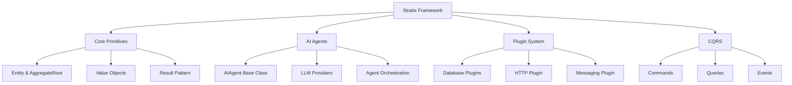

# What is Stratix?

> [!WARNING]
> **⚠️ PRE-RELEASE - ACTIVE DEVELOPMENT**
> 
> Stratix is currently in **active development** and **NOT ready for production use**. The API is unstable and may change significantly without notice. Use at your own risk for experimental projects only.

**Stratix** is a modern TypeScript framework designed for building **scalable, maintainable, and production-ready applications** with **AI agents as first-class citizens**.


## Why Stratix?

Stratix combines proven enterprise patterns with cutting-edge AI capabilities to help you build applications that are:

### 🤖 AI-First
- **AI Agents as Domain Entities** - Treat AI agents like any other domain object
- **Production-Ready AI Patterns** - Built-in orchestration, memory management, and execution tracing
- **Multiple LLM Providers** - OpenAI, Anthropic, and custom providers out of the box
- **Agent Testing** - Comprehensive testing utilities for AI agents

### 🏗️ Modular & Scalable
- **Bounded Contexts** - Portable domain modules that work in monoliths or microservices
- **Plugin Architecture** - Extensible system with lifecycle management and health checks
- **Dependency Injection** - Clean, testable code with automatic dependency resolution
- **CQRS Pattern** - Command Query Responsibility Segregation for scalable architectures

### 🚀 Enterprise-Ready
- **Domain-Driven Design** - Entity, AggregateRoot, ValueObject, and Repository patterns
- **Hexagonal Architecture** - Clean separation of concerns with ports and adapters
- **Result Pattern** - Explicit error handling without exceptions
- **Type Safety** - Full TypeScript strict mode with phantom types
- **Production Extensions** - HTTP, validation, authentication, observability

### 💎 Developer Experience
- **Powerful CLI** - Scaffold projects and generate code in seconds
- **13 Official Plugins** - Database, messaging, HTTP, AI, and utility plugins
- **Comprehensive Testing** - Built-in testing utilities and mocks
- **Complete Documentation** - Guides, tutorials, and API reference

## Key Features



### Domain Primitives
- **Entity** - Base class with identity and timestamps
- **AggregateRoot** - Entity with domain event support
- **ValueObject** - Immutable value objects
- **EntityId** - Type-safe identifiers with phantom types
- **Result** - Type-safe error handling

### AI Agent System
- **AIAgent** - Base class for AI agents as domain entities
- **LLMProvider** - Interface for LLM integrations (OpenAI, Anthropic)
- **AgentOrchestrator** - Multi-agent workflow management
- **AgentMemory** - Conversation history and context management
- **ExecutionTrace** - Detailed execution tracking and debugging

### Plugin Ecosystem
- **PostgreSQL** - Relational database integration
- **MongoDB** - Document database integration
- **Redis** - Caching and session management
- **RabbitMQ** - Message broker for event-driven architecture
- **Fastify** - High-performance HTTP server
- **OpenTelemetry** - Observability (traces, metrics, logs)
- **Zod Validation** - Schema validation
- **JWT Auth** - Authentication and RBAC authorization
- **And more...**

### Built-in Value Objects
- **Money** - Monetary values with currency support
- **Email** - Email validation
- **PhoneNumber** - International phone numbers
- **URL** - URL validation
- **UUID** - UUID generation
- **DateRange** - Date ranges
- **Percentage** - Percentage values
- **Address** - Physical addresses

## Quick Example

```typescript
import { ApplicationBuilder } from '@stratix/runtime';
import { FastifyHTTPPlugin } from '@stratix/http-fastify';
import { PostgresPlugin } from '@stratix/database-postgres';
import { OpenAIProvider } from '@stratix/ai-openai';

// Build your application
const app = await ApplicationBuilder.create()
  .useContainer(new AwilixContainer())
  .useLogger(new ConsoleLogger())
  .usePlugin(new PostgresPlugin({ /* config */ }))
  .usePlugin(new FastifyHTTPPlugin({ port: 3000 }))
  .build();

// Start the application
await app.start();

// Create an AI agent
class CustomerSupportAgent extends AIAgent<string, string> {
  readonly name = 'Customer Support';
  readonly version = AgentVersionFactory.create('1.0.0');
  readonly capabilities = [AgentCapabilities.TEXT_GENERATION];
  
  protected async execute(input: string): Promise<AgentResult<string>> {
    const response = await this.llmProvider.chat({
      model: 'gpt-4o',
      messages: [
        { role: 'system', content: 'You are a helpful customer support agent.' },
        { role: 'user', content: input }
      ]
    });
    
    return AgentResult.success(response.content, response.usage);
  }
}
```

## Who is Stratix For?

Stratix is ideal for:

- **Enterprise Teams** building scalable, maintainable applications
- **AI Developers** who want production-ready AI agent patterns
- **Backend Engineers** who value clean architecture and type safety
- **Startups** that need to move fast without sacrificing quality
- **Teams** transitioning from monoliths to microservices

## Comparison with Other Frameworks

| Feature | Stratix | NestJS | LangChain | Express |
|---------|---------|--------|-----------|---------|
| **AI Agents as First-Class Citizens** | ✅ | ❌ | ✅ | ❌ |
| **Domain-Driven Design** | ✅ | ⚠️ | ❌ | ❌ |
| **Hexagonal Architecture** | ✅ | ⚠️ | ❌ | ❌ |
| **CQRS Built-in** | ✅ | ⚠️ | ❌ | ❌ |
| **Result Pattern** | ✅ | ❌ | ❌ | ❌ |
| **Plugin System** | ✅ | ✅ | ⚠️ | ⚠️ |
| **Type Safety** | ✅ | ✅ | ⚠️ | ⚠️ |
| **Code Generation CLI** | ✅ | ✅ | ❌ | ❌ |
| **Bounded Contexts** | ✅ | ❌ | ❌ | ❌ |
| **Production-Ready AI** | ✅ | ❌ | ⚠️ | ❌ |

> **Legend**: ✅ Full Support | ⚠️ Partial Support | ❌ Not Supported

## Philosophy

Stratix is built on these core principles:

1. **AI-First** - AI agents should be treated as domain entities, not afterthoughts
2. **Domain-Driven** - Business logic belongs in the domain layer
3. **Explicit over Implicit** - Use Result pattern instead of throwing exceptions
4. **Modular** - Build portable modules that work anywhere
5. **Type-Safe** - Leverage TypeScript's type system for safety
6. **Production-Ready** - Enterprise patterns from day one

## Next Steps

Ready to get started? Here's what to do next:

1. **[Install Stratix](./installation)** - Set up your development environment
2. **[Quick Start](./quick-start)** - Build your first application in 5 minutes
3. **[Project Structure](./project-structure)** - Understand how Stratix projects are organized
4. **[Core Concepts](../core-concepts/architecture-overview)** - Learn the fundamental concepts

## Community & Support

- **GitHub**: [github.com/pcarvajal/stratix](https://github.com/pcarvajal/stratix)
- **Issues**: [Report bugs or request features](https://github.com/pcarvajal/stratix/issues)
- **Discussions**: [Ask questions and share ideas](https://github.com/pcarvajal/stratix/discussions)

## License

Stratix is [MIT licensed](https://github.com/pcarvajal/stratix/blob/main/LICENSE).
