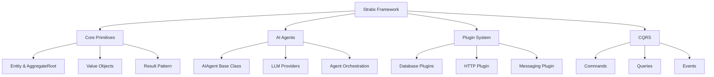

# What is Stratix?

> [!WARNING]
> **PRE-RELEASE - ACTIVE DEVELOPMENT**
>
> Stratix is currently in **active development** and **NOT ready for production use**. The API is unstable and may change significantly without notice. Use at your own risk for experimental projects only.

**Stratix** is an **agentic application framework** for TypeScript that lets you design, ship, and operate AI agents and full applications with a single end-to-end ecosystem.


## Why Stratix?

Stratix combines proven enterprise patterns with agentic capabilities so you can build applications that are:

### Agentic by design
- **AI agents as domain entities** with orchestration, memory, and execution tracing built in
- **Multiple LLM providers** out of the box (OpenAI, Anthropic, custom) with consistent interfaces
- **Agent testing and evaluation** tools to keep behavior predictable

### End-to-end ecosystem
- **Official plugins** for HTTP, databases, messaging, observability, and security
- **Context system** that keeps your modules portable between monoliths and microservices
- **Lifecycle-managed infrastructure** (init → start → stop) with health checks

### Production foundations
- **DDD + CQRS + Hexagonal** architecture baked into the primitives
- **Result pattern and type safety** (strict TS, phantom types) to avoid implicit failures
- **Built-in extensions** for validation, authentication, and mapping

### Delivery and operations
- **Stratix CLI** for scaffolding, code generation, and plugin install
- **Stratix Copilot** VS Code extension with framework knowledge
- **Comprehensive testing utilities** for agents, plugins, and domains
- **Observability hooks** for tracing, metrics, and cost tracking

## Key Features


```mermaid
graph TB
    A[Stratix Framework] --> B[Core Primitives]
    A --> C[AI Agents]
    A --> D[Plugin System]
    A --> E[CQRS]
    
    B --> B1[Entity & AggregateRoot]
    B --> B2[Value Objects]
    B --> B3[Result Pattern]
    
    C --> C1[AIAgent Base Class]
    C --> C2[LLM Providers]
    C --> C3[Agent Orchestration]
    
    D --> D1[Database Plugins]
    D --> D2[HTTP Plugin]
    D --> D3[Messaging Plugin]
    
    E --> E1[Commands]
    E --> E2[Queries]
    E --> E3[Events]
```

### Domain Primitives
- **Entity** - Base class with identity and timestamps
- **AggregateRoot** - Entity with domain event support
- **ValueObject** - Immutable value objects
- **EntityId** - Type-safe identifiers with phantom types
- **Result** - Type-safe error handling

### AI Agent System
- **AIAgent** - Base class for AI agents as domain entities
- **LLMProvider** - Interface for LLM integrations (OpenAI, Anthropic)
- **AgentOrchestrator** - Multi-agent workflow management
- **AgentMemory** - Conversation history and context management
- **ExecutionTrace** - Detailed execution tracking and debugging

### Plugin Ecosystem
- **PostgreSQL** - Relational database integration
- **MongoDB** - Document database integration
- **Redis** - Caching and session management
- **RabbitMQ** - Message broker for event-driven architecture
- **Fastify** - High-performance HTTP server
- **OpenTelemetry** - Observability (traces, metrics, logs)
- **Zod Validation** - Schema validation
- **JWT Auth** - Authentication and RBAC authorization
- **And more...**

### Built-in Value Objects
- **Money** - Monetary values with currency support
- **Email** - Email validation
- **PhoneNumber** - International phone numbers
- **URL** - URL validation
- **UUID** - UUID generation
- **DateRange** - Date ranges
- **Percentage** - Percentage values
- **Address** - Physical addresses

## Quick Example

```typescript
import { ApplicationBuilder } from '@stratix/runtime';
import { FastifyHTTPPlugin } from '@stratix/http-fastify';
import { PostgresPlugin } from '@stratix/db-postgres';
import { OpenAIProvider } from '@stratix/ai-openai';

// Build your application
const app = await ApplicationBuilder.create()
  .useContainer(new AwilixContainer())
  .useLogger(new ConsoleLogger())
  .usePlugin(new PostgresPlugin({ /* config */ }))
  .usePlugin(new FastifyHTTPPlugin({ port: 3000 }))
  .build();

// Start the application
await app.start();

// Create an AI agent
class CustomerSupportAgent extends AIAgent<string, string> {
  readonly name = 'Customer Support';
  readonly version = AgentVersionFactory.create('1.0.0');
  readonly capabilities = [AgentCapabilities.TEXT_GENERATION];
  
  protected async execute(input: string): Promise<AgentResult<string>> {
    const response = await this.llmProvider.chat({
      model: 'gpt-4o',
      messages: [
        { role: 'system', content: 'You are a helpful customer support agent.' },
        { role: 'user', content: input }
      ]
    });
    
    return AgentResult.success(response.content, response.usage);
  }
}
```

## Who is Stratix For?

Stratix is ideal for:

- **Enterprise Teams** building scalable, maintainable applications
- **AI Developers** who want production-ready AI agent patterns
- **Backend Engineers** who value clean architecture and type safety
- **Startups** that need to move fast without sacrificing quality
- **Teams** transitioning from monoliths to microservices

## Comparison with Other Frameworks

| Feature | Stratix | NestJS | LangChain | Express |
|---------|---------|--------|-----------|---------|
| **AI Agents as First-Class Citizens** | ✅ | ❌ | ✅ | ❌ |
| **Domain-Driven Design** | ✅ | ⚠️ | ❌ | ❌ |
| **Hexagonal Architecture** | ✅ | ⚠️ | ❌ | ❌ |
| **CQRS Built-in** | ✅ | ⚠️ | ❌ | ❌ |
| **Result Pattern** | ✅ | ❌ | ❌ | ❌ |
| **Plugin System** | ✅ | ✅ | ⚠️ | ⚠️ |
| **Type Safety** | ✅ | ✅ | ⚠️ | ⚠️ |
| **Code Generation CLI** | ✅ | ✅ | ❌ | ❌ |
| **Context System** | ✅ | ❌ | ❌ | ❌ |
| **Production-Ready AI** | ✅ | ❌ | ⚠️ | ❌ |

> **Legend**: ✅ Full Support | ⚠️ Partial Support | ❌ Not Supported

## Philosophy

Stratix is built on these core principles:

1. **AI-First** - AI agents should be treated as domain entities, not afterthoughts
2. **Domain-Driven** - Business logic belongs in the domain layer
3. **Explicit over Implicit** - Use Result pattern instead of throwing exceptions
4. **Modular** - Build portable modules that work anywhere
5. **Type-Safe** - Leverage TypeScript's type system for safety
6. **Production-Ready** - Enterprise patterns from day one

## Next Steps

Ready to get started? Here's what to do next:

1. **[Install Stratix](./installation)** - Set up your development environment
2. **[Quick Start](./quick-start)** - Build your first application in 5 minutes
3. **[Project Structure](./project-structure)** - Understand how Stratix projects are organized
4. **[Core Concepts](../core-concepts/architecture-overview)** - Learn the fundamental concepts

## Community & Support

- **GitHub**: [github.com/stratix-dev/stratix](https://github.com/stratix-dev/stratix)
- **Issues**: [Report bugs or request features](https://github.com/stratix-dev/stratix/issues)
- **Discussions**: [Ask questions and share ideas](https://github.com/stratix-dev/stratix/discussions)

## License

Stratix is [MIT licensed](https://github.com/stratix-dev/stratix/blob/main/LICENSE).
