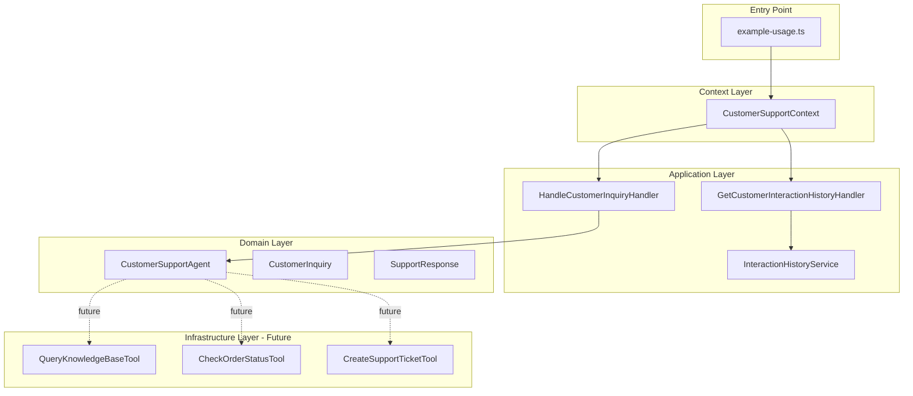
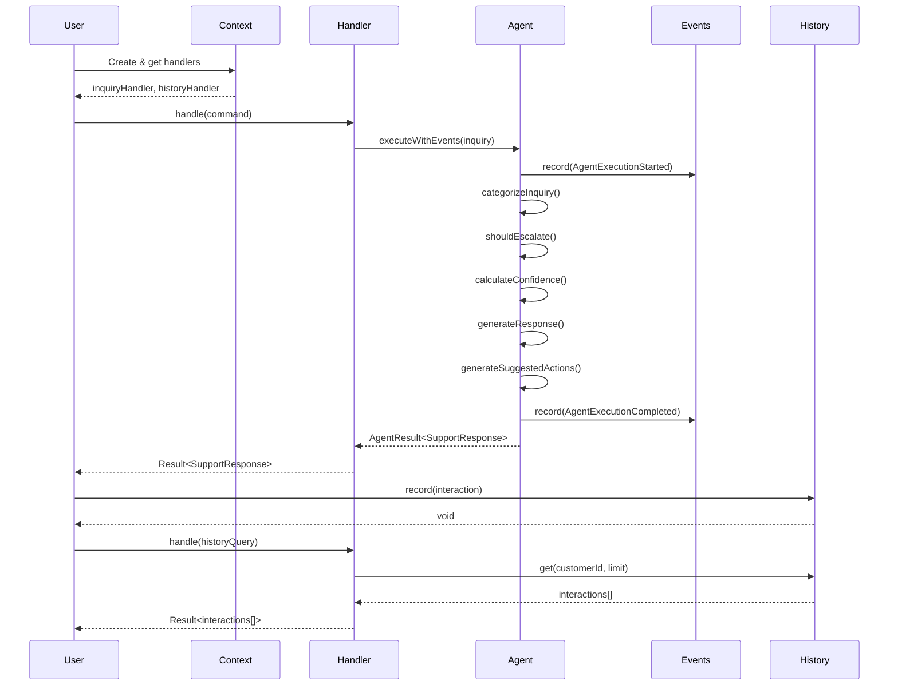
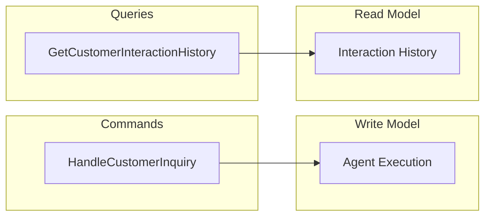
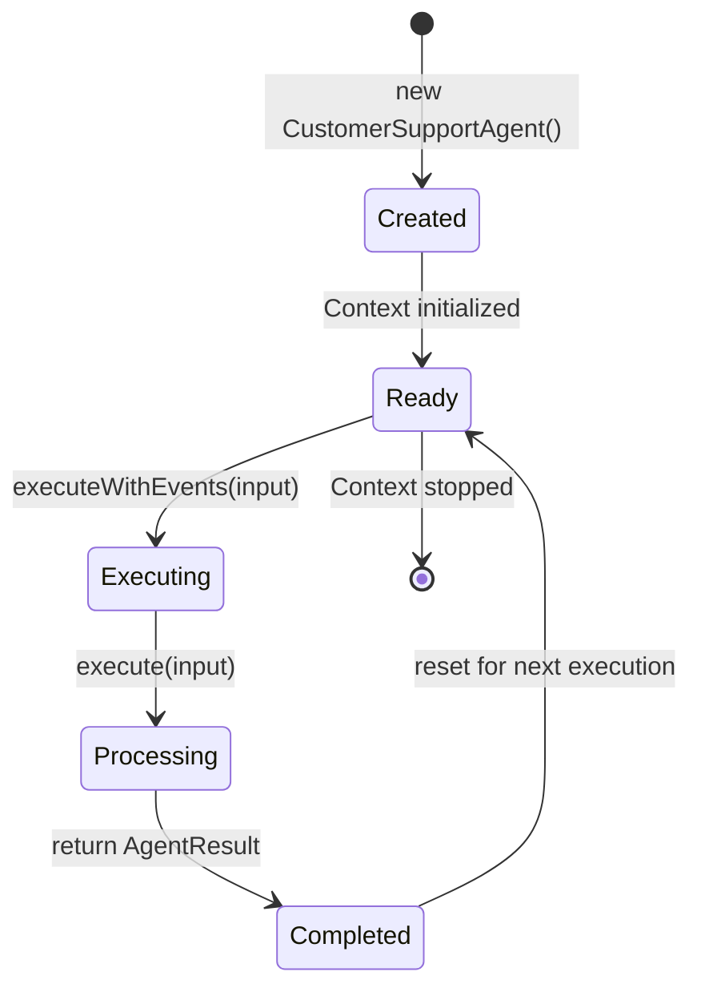

# Arquitectura del Customer Support Agent

Este documento explica la arquitectura y los patrones de diseño utilizados en el ejemplo del agente de soporte al cliente.

## Diagrama de Arquitectura General



## Flujo de Ejecución Completo



## Capas de la Arquitectura

### 1. Entry Point Layer

**Archivo:** `example-usage.ts`

```typescript
// Crea el contexto
const context = new CustomerSupportContext();

// Obtiene handlers
const inquiryHandler = context.getInquiryHandler();
const historyHandler = context.getHistoryHandler();
const agent = context.getAgent();

// Usa los handlers directamente
const result = await inquiryHandler.handle(command);
```

**Responsabilidades:**
- Instanciar el contexto
- Coordinar el flujo de ejemplo
- Demostrar el uso de la API

### 2. Context Layer

**Archivo:** `CustomerSupportContext.ts`

```typescript
export class CustomerSupportContext implements Context {
  readonly metadata: ContextMetadata = {
    name: 'customer-support-context',
    version: '1.0.0',
    description: 'Customer Support Agent Context',
  };

  readonly name = 'CustomerSupport';

  private agent: CustomerSupportAgent;
  private historyService: InteractionHistoryService;
  private inquiryHandler: HandleCustomerInquiryHandler;
  private historyHandler: GetCustomerInteractionHistoryHandler;

  constructor() {
    // Inicializa todo en el constructor
    this.agent = new CustomerSupportAgent(...);
    this.historyService = new InteractionHistoryService();
    this.inquiryHandler = new HandleCustomerInquiryHandler(this.agent);
    this.historyHandler = new GetCustomerInteractionHistoryHandler(this.historyService);
  }

  getCommands(): ContextCommandDefinition[] { }
  getQueries(): ContextQueryDefinition[] { }
}
```

**Responsabilidades:**
- Crear y coordinar todos los componentes
- Implementar la interfaz `Context` de Stratix
- Proporcionar acceso a handlers y servicios
- Definir metadata del contexto

### 3. Application Layer

#### Command Handler

**Archivo:** `application/commands/HandleCustomerInquiry.ts`

```typescript
export interface HandleCustomerInquiryCommand extends Command {
  readonly inquiry: CustomerInquiry;
}

export class HandleCustomerInquiryHandler
  implements CommandHandler<HandleCustomerInquiryCommand, Result<SupportResponse, Error>>
{
  constructor(private readonly agent: CustomerSupportAgent) {}

  async handle(command: HandleCustomerInquiryCommand): Promise<Result<SupportResponse, Error>> {
    const agentResult = await this.agent.executeWithEvents(command.inquiry);

    if (agentResult.isSuccess()) {
      return Success.create(agentResult.data);
    } else {
      return Failure.create(agentResult.error || new Error('Agent execution failed'));
    }
  }
}
```

**Responsabilidades:**
- Validar comandos
- Ejecutar el agente
- Convertir `AgentResult` a `Result`
- Manejo de errores

#### Query Handler

**Archivo:** `application/queries/GetCustomerInteractionHistory.ts`

```typescript
export interface GetCustomerInteractionHistoryQuery extends Query {
  readonly customerId: string;
  readonly limit: number;
}

export class GetCustomerInteractionHistoryHandler
  implements QueryHandler<GetCustomerInteractionHistoryQuery, Result<CustomerInteraction[], Error>>
{
  constructor(private readonly historyService: InteractionHistoryService) {}

  async handle(query: GetCustomerInteractionHistoryQuery): Promise<Result<CustomerInteraction[], Error>> {
    const interactions = this.historyService.get(query.customerId, query.limit);
    return Success.create(interactions);
  }
}
```

**Responsabilidades:**
- Consultar historial
- Retornar resultados paginados
- No modificar estado (read-only)

#### Interaction History Service

```typescript
export class InteractionHistoryService {
  private history: Map<string, CustomerInteraction[]> = new Map();

  record(customerId: string, interaction: CustomerInteraction): void {
    const existing = this.history.get(customerId) || [];
    existing.push(interaction);
    this.history.set(customerId, existing);
  }

  get(customerId: string, limit: number = 10): CustomerInteraction[] {
    const interactions = this.history.get(customerId) || [];
    return interactions
      .sort((a, b) => b.timestamp.getTime() - a.timestamp.getTime())
      .slice(0, limit);
  }
}
```

**Responsabilidades:**
- Almacenar interacciones en memoria
- Recuperar historial por cliente
- Ordenar por timestamp descendente

### 4. Domain Layer

#### Customer Support Agent

**Archivo:** `domain/CustomerSupportAgent.ts`

```typescript
export class CustomerSupportAgent extends AIAgent<CustomerInquiry, SupportResponse> {
  readonly name = 'Customer Support Agent';
  readonly description = 'Handles customer support inquiries...';
  readonly version = AgentVersionFactory.create('1.0.0');
  readonly capabilities: AgentCapability[] = [
    AgentCapabilities.CUSTOMER_SUPPORT,
    AgentCapabilities.SENTIMENT_ANALYSIS,
    'ticket_creation',
    'knowledge_base_search',
  ];
  readonly model: ModelConfig = {
    provider: 'openai',
    model: 'gpt-4',
    temperature: 0.7,
    maxTokens: 1000,
  };

  constructor(
    id: EntityId<'AIAgent'>,
    createdAt: Date,
    updatedAt: Date,
    private readonly systemInstructions?: string
  ) {
    super(id, createdAt, updatedAt);
  }

  protected async execute(input: CustomerInquiry): Promise<AgentResult<SupportResponse>> {
    const category = this.categorizeInquiry(input);
    const escalationRequired = this.shouldEscalate(input);
    const confidence = this.calculateConfidence(input);
    const responseText = this.generateResponse(input, category, escalationRequired);
    const suggestedActions = this.generateSuggestedActions(category, escalationRequired);

    return AgentResult.success({ responseText, suggestedActions, escalationRequired, confidence, category }, {
      model: this.model.model,
      duration: Date.now() - startTime,
    });
  }
}
```

**Responsabilidades:**
- Extender `AIAgent<TInput, TOutput>`
- Implementar método `execute()` protegido
- Categorizar inquiries
- Detectar necesidad de escalación
- Generar respuestas contextuales
- Calcular confianza
- Publicar eventos de dominio automáticamente

**Métodos Privados Clave:**

1. **categorizeInquiry()**: Analiza el texto y asigna categoría
2. **shouldEscalate()**: Determina si requiere intervención humana
3. **calculateConfidence()**: Calcula score de confianza
4. **generateResponse()**: Genera texto de respuesta
5. **generateSuggestedActions()**: Genera acciones recomendadas

### 5. Infrastructure Layer (Tools - Future)

Las tools están implementadas pero no conectadas al agente actualmente:

```typescript
export class QueryKnowledgeBaseTool extends AgentTool<KnowledgeBaseQuery, KnowledgeBaseResult> {
  readonly name = 'query_knowledge_base';
  readonly description = 'Search the knowledge base for relevant articles';

  async execute(input: KnowledgeBaseQuery): Promise<KnowledgeBaseResult> {
    // Búsqueda por keywords
    // Filtrado por categoría
    // Ordenamiento por relevancia
  }

  async validate(input: unknown): Promise<KnowledgeBaseQuery> {
    // Validación de input
  }

  getDefinition(): ToolDefinition {
    // Definición para LLM function calling
  }
}
```

## Patrones de Diseño

### 1. Domain-Driven Design (DDD)

#### Bounded Context

```
CustomerSupportContext
├── Domain
│   ├── Aggregates: CustomerSupportAgent
│   └── Value Objects: CustomerInquiry, SupportResponse
├── Application
│   ├── Commands: HandleCustomerInquiry
│   └── Queries: GetCustomerInteractionHistory
└── Infrastructure
    ├── Services: InteractionHistoryService
    └── Tools: KB, Orders, Tickets
```

#### Ubiquitous Language

- **Inquiry** (no "question" o "request")
- **Escalation** (no "forward" o "transfer")
- **Confidence** (no "certainty" o "trust")
- **Category** (no "type" o "kind")

### 2. CQRS (Command Query Responsibility Segregation)



**Separación:**
- Commands modifican estado (ejecutar agente)
- Queries solo leen (obtener historial)
- Diferentes modelos de datos
- Optimización independiente

### 3. Result Pattern

```typescript
// Success case
const result = Success.create(data);
result.isSuccess // true
result.value // data

// Failure case
const result = Failure.create(new Error('Failed'));
result.isSuccess // false
result.error // Error object
```

**Beneficios:**
- Errores explícitos en firma de función
- No try/catch en código de negocio
- Type-safe error handling
- Composable con map/flatMap

### 4. Strategy Pattern

Diferentes estrategias de categorización y escalación:

```typescript
// Estrategia de categorización
private categorizeInquiry(input: CustomerInquiry): Category {
  if (input.category) return input.category; // Explicit strategy

  // Keyword-based strategy
  const text = input.inquiryText.toLowerCase();
  if (text.includes('refund')) return 'billing';
  if (text.includes('crash')) return 'technical';
  // ...
}

// Estrategia de escalación
private shouldEscalate(input: CustomerInquiry): boolean {
  if (category === 'complaint') return true; // Always escalate complaints
  if (previousAttempts >= 3) return true; // Escalate after failures
  if (hasUrgentKeywords) return true; // Escalate urgent issues
  return false;
}
```

### 5. Event Sourcing (Parcial)

Todos los cambios se registran como eventos:

```typescript
// Eventos automáticos del AIAgent
AgentExecutionStarted {
  occurredAt: Date,
  agentId: string,
  agentName: string,
  input: CustomerInquiry,
  contextId?: string
}

AgentExecutionCompleted {
  occurredAt: Date,
  agentId: string,
  output: SupportResponse,
  durationMs: number,
  tokensUsed?: number,
  cost?: number
}
```

## Principios SOLID

### Single Responsibility Principle (SRP)

Cada clase tiene una única responsabilidad:

- `CustomerSupportAgent`: Procesar inquiries
- `HandleCustomerInquiryHandler`: Coordinar ejecución
- `InteractionHistoryService`: Gestionar historial
- `CustomerSupportContext`: Configurar y coordinar

### Open/Closed Principle (OCP)

Abierto a extensión, cerrado a modificación:

```typescript
// Agregar nueva categoría sin modificar código existente
type Category = 'billing' | 'technical' | 'general' | 'complaint' | 'shipping';

// Agregar nueva tool
class TrackShipmentTool extends AgentTool<...> { }
```

### Liskov Substitution Principle (LSP)

```typescript
// Cualquier AIAgent puede usarse de la misma forma
function executeAgent<TIn, TOut>(agent: AIAgent<TIn, TOut>, input: TIn) {
  return agent.executeWithEvents(input);
}

// Funciona con CustomerSupportAgent o cualquier otro
const result = executeAgent(customerSupportAgent, inquiry);
```

### Interface Segregation Principle (ISP)

Interfaces específicas y enfocadas:

```typescript
// Solo métodos necesarios
interface Context {
  readonly metadata: ContextMetadata;
  readonly name: string;
  getCommands?(): ContextCommandDefinition[];
  getQueries?(): ContextQueryDefinition[];
  // No fuerza implementar métodos innecesarios
}
```

### Dependency Inversion Principle (DIP)

Depende de abstracciones:

```typescript
// Handler depende de abstracción Agent, no de implementación
class HandleCustomerInquiryHandler {
  constructor(private readonly agent: AIAgent<CustomerInquiry, SupportResponse>) {}
}
```

## Flujo de Datos

### Input Flow

```
Usuario
  ↓ (crea)
HandleCustomerInquiryCommand
  ↓ (pasa a)
Handler.handle()
  ↓ (ejecuta)
Agent.executeWithEvents()
  ↓ (procesa)
AgentResult<SupportResponse>
  ↓ (convierte a)
Result<SupportResponse>
  ↓ (retorna a)
Usuario
```

### Event Flow

```
Agent.executeWithEvents()
  ↓ (publica)
AgentExecutionStarted
  ↓ (ejecuta lógica)
execute()
  ↓ (publica)
AgentExecutionCompleted
  ↓ (almacena en)
Agent.domainEvents[]
  ↓ (pull)
Agent.pullDomainEvents()
  ↓ (procesa)
EventHandlers / Subscribers
```

## Estado y Ciclo de Vida

### Estado del Agente

```typescript
class CustomerSupportAgent {
  // Immutable state
  readonly name: string
  readonly version: AgentVersion
  readonly capabilities: AgentCapability[]
  readonly model: ModelConfig

  // Identity (from Entity)
  readonly id: EntityId<'AIAgent'>
  readonly createdAt: Date
  readonly updatedAt: Date

  // Mutable state (protected)
  protected _context?: AgentContext
  protected _memory?: AgentMemory
  protected domainEvents: DomainEvent[]
}
```

### Ciclo de Vida del Agente



## Extensibilidad

### Agregar Nueva Funcionalidad

1. **Nueva Categoría:**
```typescript
// 1. Actualizar tipos
type Category = '...' | 'shipping';

// 2. Actualizar categorizeInquiry()
if (text.includes('track')) return 'shipping';

// 3. Actualizar generateResponse()
case 'shipping': return 'Tracking info...';
```

2. **Nueva Tool:**
```typescript
// 1. Crear tool
class NewTool extends AgentTool<TIn, TOut> { }

// 2. Registrar en agent
readonly capabilities = [..., 'new_tool'];

// 3. Conectar en execute()
const tools = [queryKbTool, checkOrderTool, newTool];
```

3. **Nueva Métrica:**
```typescript
// 1. Agregar a SupportResponse
interface SupportResponse {
  // ...
  sentiment?: 'positive' | 'neutral' | 'negative';
}

// 2. Calcular en execute()
const sentiment = this.analyzeSentiment(input);
```

## Testing Strategy

### Unit Tests

```typescript
describe('CustomerSupportAgent', () => {
  it('should categorize billing inquiries', () => {
    // Test lógica de categorización aislada
  });

  it('should escalate complaints', () => {
    // Test lógica de escalación
  });
});
```

### Integration Tests

```typescript
describe('HandleCustomerInquiryHandler', () => {
  it('should execute agent and return result', async () => {
    // Test integración handler + agent
  });
});
```

### E2E Tests

```typescript
describe('Customer Support Flow', () => {
  it('should handle full inquiry flow', async () => {
    // Test flujo completo desde context hasta resultado
  });
});
```

## Consideraciones de Performance

### Optimizaciones Actuales

1. **Ejecución Síncrona**: Procesamiento directo sin I/O
2. **Memoria In-Memory**: Acceso O(1) a historial
3. **Cálculo Simple**: Categorización basada en keywords

### Optimizaciones Futuras

1. **Caching de Categorización**
2. **Batch Processing de Inquiries**
3. **Async Tool Execution**
4. **Streaming Responses**

## Seguridad

### Validación de Input

```typescript
async validate(input: unknown): Promise<CustomerInquiry> {
  // Validar estructura
  // Sanitizar texto
  // Validar categoría
}
```

### Rate Limiting

```typescript
// Futuro: limitar requests por customer
if (await rateLimiter.isExceeded(customerId)) {
  throw new RateLimitError();
}
```

### PII Protection

```typescript
// Sanitizar antes de loguear
const sanitized = removePII(inquiry.inquiryText);
logger.info({ inquiry: sanitized });
```

## Conclusión

Esta arquitectura proporciona:

✅ **Separación de responsabilidades** clara
✅ **Alta testabilidad** con mocks
✅ **Extensibilidad** sin modificar código existente
✅ **Type safety** completa con TypeScript
✅ **Event sourcing** para auditoría
✅ **CQRS** para escalabilidad
✅ **DDD** para modelado de dominio rico
