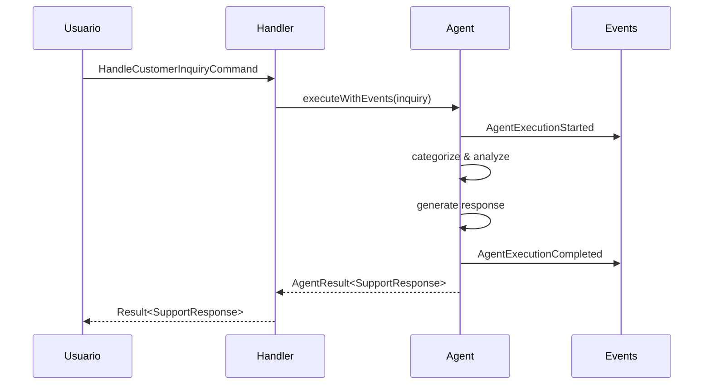

# Customer Support AI Agent Example

Este ejemplo demuestra cómo implementar un agente de IA para soporte al cliente usando el framework Stratix, siguiendo los principios de Domain-Driven Design (DDD), CQRS y arquitectura hexagonal.

## Estructura del Proyecto

```
customer-support-agent/
├── domain/
│   └── CustomerSupportAgent.ts           # Agente de IA como entidad de dominio
├── application/
│   ├── commands/
│   │   └── HandleCustomerInquiry.ts      # Comando para manejar consultas
│   └── queries/
│       └── GetCustomerInteractionHistory.ts  # Query para historial
├── infrastructure/
│   └── tools/                            # Herramientas del agente
│       ├── QueryKnowledgeBaseTool.ts     # Búsqueda en KB
│       ├── CheckOrderStatusTool.ts       # Estado de pedidos
│       └── CreateSupportTicketTool.ts    # Creación de tickets
├── tests/
│   └── CustomerSupportAgent.test.ts      # Tests unitarios
├── CustomerSupportContext.ts             # Bounded context
├── example-usage.ts                      # Ejemplo de uso
├── package.json
└── README.md
```

## Características del Agente

El **CustomerSupportAgent** es un agente de IA que:

1. **Categoriza automáticamente** las consultas en:
   - Billing (facturación)
   - Technical (soporte técnico)
   - General (consultas generales)
   - Complaint (quejas)

2. **Detecta escalación automática** basado en:
   - Tipo de consulta (complaints siempre escalan)
   - Palabras clave urgentes (urgent, emergency, immediately)
   - Intentos previos fallidos (3 o más)

3. **Genera respuestas contextuales** según la categoría
4. **Proporciona acciones sugeridas** específicas
5. **Calcula confianza** de la respuesta
6. **Registra eventos de dominio** para auditoría

## Instalación y Uso

### 1. Instalación

```bash
cd examples/customer-support-agent
pnpm install
```

### 2. Configurar API Key de OpenAI

Este ejemplo usa la API real de OpenAI. Necesitas configurar tu API key:

```bash
# Exportar la API key como variable de entorno
export OPENAI_API_KEY=sk-tu-api-key-aqui

# O crear un archivo .env (no lo agregues a git)
echo "OPENAI_API_KEY=sk-tu-api-key-aqui" > .env
```

Para obtener una API key:
1. Visita [platform.openai.com](https://platform.openai.com)
2. Crea una cuenta o inicia sesión
3. Ve a API Keys en tu perfil
4. Crea una nueva API key

**Nota sobre costos**: Este ejemplo usa GPT-4o-mini que tiene los siguientes precios:
- Input: $0.15 por 1M tokens
- Output: $0.60 por 1M tokens

Cada consulta del ejemplo usa aproximadamente 200-500 tokens, lo que cuesta menos de $0.001 por ejecución (muy económico).

### 3. Ejecutar el Ejemplo

```bash
pnpm start
```

El ejemplo realizará llamadas reales a la API de OpenAI y mostrará:
- Respuestas generadas por IA para consultas de clientes
- Categorización automática (billing, technical, general, complaint)
- Detección de escalación basada en el contexto
- Acciones sugeridas personalizadas
- Uso de tokens y costo de cada consulta

### 4. Ejecutar Tests

```bash
pnpm test
```

**Nota**: Los tests usan un LLM provider mock y no requieren API key.

### 5. Verificar Tipos

```bash
pnpm typecheck
```

## Uso Programático

### Configurar el OpenAI Provider

```typescript
import { OpenAIProvider } from '@stratix/ai-openai';

const openAIProvider = new OpenAIProvider({
  apiKey: process.env.OPENAI_API_KEY!,
  models: [
    {
      name: 'gpt-4o',
      pricing: {
        input: 2.5,  // $2.50 per 1M tokens
        output: 10.0 // $10.00 per 1M tokens
      }
    }
  ]
});
```

### Crear el Contexto

```typescript
import { CustomerSupportContext } from './CustomerSupportContext.js';

const context = new CustomerSupportContext(openAIProvider);
const inquiryHandler = context.getInquiryHandler();
```

### Manejar una Consulta

```typescript
import type { HandleCustomerInquiryCommand } from './application/commands/HandleCustomerInquiry.js';

const command: HandleCustomerInquiryCommand = {
  inquiry: {
    customerId: 'cust-12345',
    inquiryText: 'I was charged twice for my order',
    category: 'billing',
  },
};

const result = await inquiryHandler.handle(command);

if (result.isSuccess) {
  console.log('Response:', result.value.responseText);
  console.log('Escalation Required:', result.value.escalationRequired);
  console.log('Confidence:', result.value.confidence);
}
```

### Consultar Historial

```typescript
import type { GetCustomerInteractionHistoryQuery } from './application/queries/GetCustomerInteractionHistory.js';

const query: GetCustomerInteractionHistoryQuery = {
  customerId: 'cust-12345',
  limit: 10,
};

const history = await historyHandler.handle(query);

if (history.isSuccess) {
  history.value.forEach((interaction) => {
    console.log(`${interaction.timestamp}: ${interaction.inquiry}`);
  });
}
```

## Arquitectura

### Capas de la Aplicación

```
┌─────────────────────────────────────┐
│      Application Entry Point       │
│         (example-usage.ts)          │
└──────────────┬──────────────────────┘
               │
               ▼
┌─────────────────────────────────────┐
│     CustomerSupportContext          │
│  (Bounded Context - Coordinates)    │
└──────────────┬──────────────────────┘
               │
               ├─────────────────────────┐
               ▼                         ▼
┌──────────────────────┐    ┌──────────────────────┐
│  Application Layer   │    │    Domain Layer      │
│                      │    │                      │
│  - Command Handlers  │◄───┤ CustomerSupportAgent │
│  - Query Handlers    │    │   (AI Agent)         │
└──────────┬───────────┘    └──────────────────────┘
           │
           ▼
┌─────────────────────────────────────┐
│      Infrastructure Layer           │
│  - AgentTools (future extension)    │
│  - InteractionHistoryService        │
└─────────────────────────────────────┘
```

### Flujo de Ejecución



## Patrones Implementados

### 1. Domain-Driven Design (DDD)

- **Agente como Aggregate Root**: `CustomerSupportAgent` extiende `AIAgent<TInput, TOutput>`
- **Value Objects**: `CustomerInquiry`, `SupportResponse`
- **Domain Events**: `AgentExecutionStarted`, `AgentExecutionCompleted`
- **Bounded Context**: `CustomerSupportContext`

### 2. CQRS (Command Query Responsibility Segregation)

**Commands (Write):**
```typescript
interface HandleCustomerInquiryCommand extends Command {
  readonly inquiry: CustomerInquiry;
}
```

**Queries (Read):**
```typescript
interface GetCustomerInteractionHistoryQuery extends Query {
  readonly customerId: string;
  readonly limit: number;
}
```

### 3. Result Pattern

Manejo de errores explícito sin excepciones:

```typescript
const result = await handler.handle(command);

if (result.isSuccess) {
  // Usar result.value
} else {
  // Manejar result.error
}
```

### 4. Event Sourcing (Parcial)

Todos los eventos del agente se registran automáticamente:

```typescript
const agent = context.getAgent();
const events = agent.pullDomainEvents();

events.forEach((event) => {
  console.log(`${event.eventType} at ${event.occurredAt}`);
});
```

## Tipos de Datos

### CustomerInquiry

```typescript
interface CustomerInquiry {
  customerId: string;
  inquiryText: string;
  category?: 'billing' | 'technical' | 'general' | 'complaint';
  previousContext?: string[];
}
```

### SupportResponse

```typescript
interface SupportResponse {
  responseText: string;
  suggestedActions: string[];
  escalationRequired: boolean;
  confidence: number;
  category: 'billing' | 'technical' | 'general' | 'complaint';
}
```

## Ejemplos de Uso

### Ejemplo 1: Consulta de Facturación

```typescript
const billing: HandleCustomerInquiryCommand = {
  inquiry: {
    customerId: 'cust-001',
    inquiryText: 'I was charged twice for my order',
    category: 'billing',
  },
};

const result = await inquiryHandler.handle(billing);
// Auto-categoriza como 'billing'
// escalationRequired: false
// confidence: 0.85
```

### Ejemplo 2: Problema Técnico con Escalación

```typescript
const technical: HandleCustomerInquiryCommand = {
  inquiry: {
    customerId: 'cust-002',
    inquiryText: 'URGENT: App crashes immediately on startup',
    category: 'technical',
  },
};

const result = await inquiryHandler.handle(technical);
// Detecta palabra 'URGENT'
// escalationRequired: true
```

### Ejemplo 3: Auto-Categorización

```typescript
const inquiry: HandleCustomerInquiryCommand = {
  inquiry: {
    customerId: 'cust-003',
    inquiryText: 'I need a refund for my payment',
    // No category provided
  },
};

const result = await inquiryHandler.handle(inquiry);
// Auto-categoriza como 'billing' (detecta 'refund', 'payment')
```

## Extensión

### Agregar Nuevas Categorías

Modifica los tipos en `CustomerSupportAgent.ts`:

```typescript
type Category = 'billing' | 'technical' | 'general' | 'complaint' | 'shipping';

// Actualiza categorizeInquiry()
private categorizeInquiry(input: CustomerInquiry): Category {
  // Agregar lógica para 'shipping'
  if (text.includes('track') || text.includes('shipping')) {
    return 'shipping';
  }
  // ...
}
```

### Agregar Herramientas (Tools)

Crea nuevas herramientas extendiendo `AgentTool`:

```typescript
import { AgentTool, type ToolDefinition } from '@stratix/core';

export class CheckInventoryTool extends AgentTool<
  { productId: string },
  { inStock: boolean; quantity: number }
> {
  readonly name = 'check_inventory';
  readonly description = 'Check product inventory status';

  async execute(input: { productId: string }) {
    // Implementación
    return { inStock: true, quantity: 50 };
  }

  async validate(input: unknown) {
    // Validación
    return input as { productId: string };
  }

  getDefinition(): ToolDefinition {
    return {
      name: this.name,
      description: this.description,
      parameters: {
        type: 'object',
        properties: {
          productId: { type: 'string' },
        },
        required: ['productId'],
      },
    };
  }
}
```

## Testing

El ejemplo incluye tests comprehensivos:

```bash
pnpm test
```

Tests incluidos:
- ✅ Configuración del agente
- ✅ Manejo de diferentes tipos de consultas
- ✅ Auto-categorización
- ✅ Detección de escalación
- ✅ Generación de acciones sugeridas
- ✅ Registro de eventos de dominio
- ✅ Scoring de confianza

## Consideraciones de Producción

### 1. Proveedores de LLM Alternativos

Este ejemplo usa OpenAI, pero Stratix soporta múltiples proveedores. Para usar Anthropic Claude:

```typescript
import { AnthropicProvider } from '@stratix/ai-anthropic';

const anthropicProvider = new AnthropicProvider({
  apiKey: process.env.ANTHROPIC_API_KEY!,
  models: [
    {
      name: 'claude-3-5-sonnet-20241022',
      pricing: {
        input: 3.0,   // $3.00 per 1M tokens
        output: 15.0  // $15.00 per 1M tokens
      }
    }
  ]
});

const context = new CustomerSupportContext(anthropicProvider);
```

También puedes cambiar el modelo en el agente editando `domain/CustomerSupportAgent.ts`:

```typescript
readonly model: ModelConfig = {
  provider: 'openai',
  model: 'gpt-4o-mini',  // Más económico ($0.15/$0.60 por 1M tokens)
  // model: 'gpt-4o',    // Más potente ($2.50/$10.00 por 1M tokens)
  // model: 'gpt-4-turbo', // Alternativa
  temperature: 0.7,
  maxTokens: 1000,
};
```

**Nota importante**: Solo los modelos que soportan JSON mode funcionarán con este ejemplo:
- ✅ `gpt-4o-mini` (recomendado para producción, muy económico)
- ✅ `gpt-4o` (mejor calidad, más caro)
- ✅ `gpt-4-turbo`
- ❌ `gpt-4` (no soporta JSON mode)

### 2. Persistencia

Implementa repositorios reales:

```typescript
class PostgresInteractionHistoryService {
  async record(customerId: string, interaction: CustomerInteraction) {
    await this.db.query(
      'INSERT INTO interactions (customer_id, inquiry, response, category, escalated, timestamp) VALUES ($1, $2, $3, $4, $5, $6)',
      [customerId, interaction.inquiry, interaction.response, interaction.category, interaction.escalated, interaction.timestamp]
    );
  }
}
```

### 3. Monitoreo

Suscríbete a eventos de dominio:

```typescript
eventBus.subscribe('AgentExecutionCompleted', async (event) => {
  // Enviar métricas a sistema de monitoring
  metrics.record({
    agent: event.agentName,
    duration: event.durationMs,
    tokens: event.tokensUsed,
    cost: event.cost,
  });
});
```

## Mejores Prácticas

1. **Siempre usa Result Pattern** - No lances excepciones
2. **Registra interacciones** - Mantén historial completo
3. **Monitorea confianza** - Alerta en baja confianza
4. **Escala apropiadamente** - No subestimes ni sobreestimes
5. **Prueba exhaustivamente** - Cubre todos los escenarios
6. **Documenta decisiones** - Explica lógica de categorización

## Recursos

- [Documentación de Stratix](../../README.md)
- [ARCHITECTURE.md](./ARCHITECTURE.md) - Arquitectura detallada
- [EXAMPLES.md](./EXAMPLES.md) - Más ejemplos de uso
