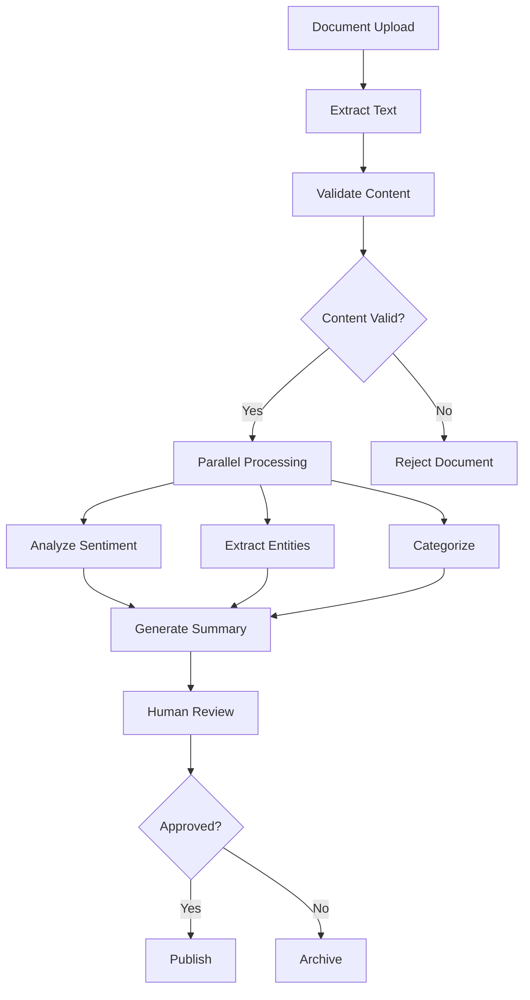

# Document Processing Workflow Example

This example demonstrates Stratix's Workflow Engine for orchestrating complex multi-step AI processes.

## Features Demonstrated

- **Workflow Builder**: Fluent API for building workflows
- **Workflow Engine**: Execute complex multi-step processes
- **Step Types**: Agent, Tool, Conditional, Parallel, Loop, Transform
- **Error Handling**: Robust error handling with retry policies
- **Telemetry**: Track workflow execution metrics

## Workflow Overview

This example processes incoming documents through multiple stages:



## Workflow Steps

1. **Extract Text**: Use AI agent to extract text from document
2. **Validate**: Check document meets quality requirements
3. **Conditional**: Branch based on validation result
4. **Parallel Processing**:
   - Sentiment analysis
   - Entity extraction
   - Content categorization
5. **Generate Summary**: Combine results into executive summary
6. **Human Review**: Request approval from reviewer
7. **Final Action**: Publish or archive based on approval

## Setup

```bash
# Install dependencies
pnpm install

# Run the example
npx tsx index.ts
```

## Code Structure

The example demonstrates:

- **WorkflowBuilder**: Building workflows with fluent API
- **Step Configuration**: Configuring different step types
- **Variable Management**: Passing data between steps
- **Error Handling**: Retry policies and error recovery
- **Telemetry**: Tracking workflow execution

## Example Output

```
Building workflow...
✓ Workflow created with 8 steps

Executing workflow for document: contract-2024.pdf
────────────────────────────────────────────────────────

Step 1/8: Extract text from document
  ✓ Extracted 1,247 words

Step 2/8: Validate content
  ✓ Content validation passed

Step 3/8: Check validation result
  ✓ Taking 'valid' branch

Step 4/8: Parallel analysis
  ↻ Running 3 branches in parallel
  ✓ Sentiment: Positive (0.85)
  ✓ Entities: 12 found (3 organizations, 9 people)
  ✓ Category: Legal/Contract

Step 5/8: Generate summary
  ✓ Summary generated (234 words)

Step 6/8: Human review
  ⏸  Waiting for approval...
  ✓ Approved by: reviewer@company.com

Step 7/8: Publish decision
  ✓ Taking 'publish' branch

Step 8/8: Publish document
  ✓ Document published successfully

Workflow Metrics:
─────────────────
Total Steps: 8
Completed: 8
Failed: 0
Duration: 3,245ms
```

## Key Concepts

### Workflow Variables

Variables flow between steps:
- `documentId` - Input variable
- `extractedText` - From extract step
- `isValid` - From validation step
- `sentiment`, `entities`, `category` - From parallel analysis
- `summary` - From generate step
- `approved` - From human review

### Conditional Logic

```typescript
.condition(
  '${isValid}',
  (then) => then
    .parallel(/* analysis steps */)
    .transform(/* summary */),
  (else) => else
    .tool('rejectDocument', /* ... */)
)
```

### Parallel Execution

```typescript
.parallel(
  (b1) => b1.agent('sentiment-analyzer', /* ... */),
  (b2) => b2.agent('entity-extractor', /* ... */),
  (b3) => b3.agent('categorizer', /* ... */)
)
```

### Human in the Loop

```typescript
.humanApproval(
  'Review and approve this document',
  ['Approve', 'Reject', 'Request Changes'],
  { timeout: 3600000, assignee: 'reviewer@company.com' }
)
```

## Best Practices

1. **Use Variables**: Pass data between steps via variables
2. **Error Handling**: Configure retry policies for unstable steps
3. **Telemetry**: Track execution for debugging and optimization
4. **Type Safety**: Use WorkflowBuilder for compile-time checks
5. **Testing**: Test workflows with mock handlers
