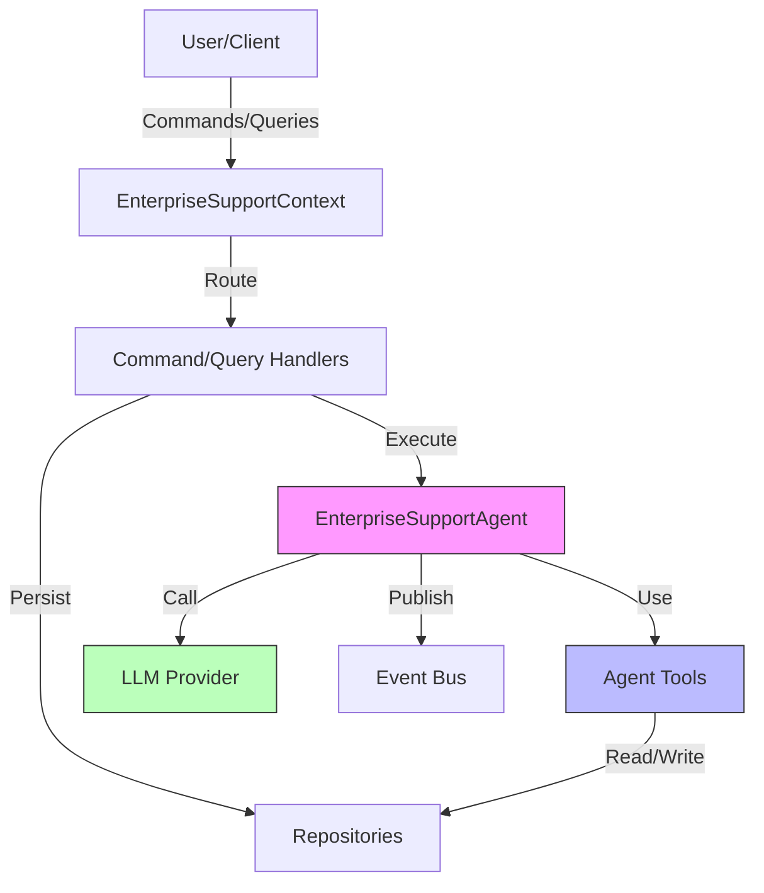
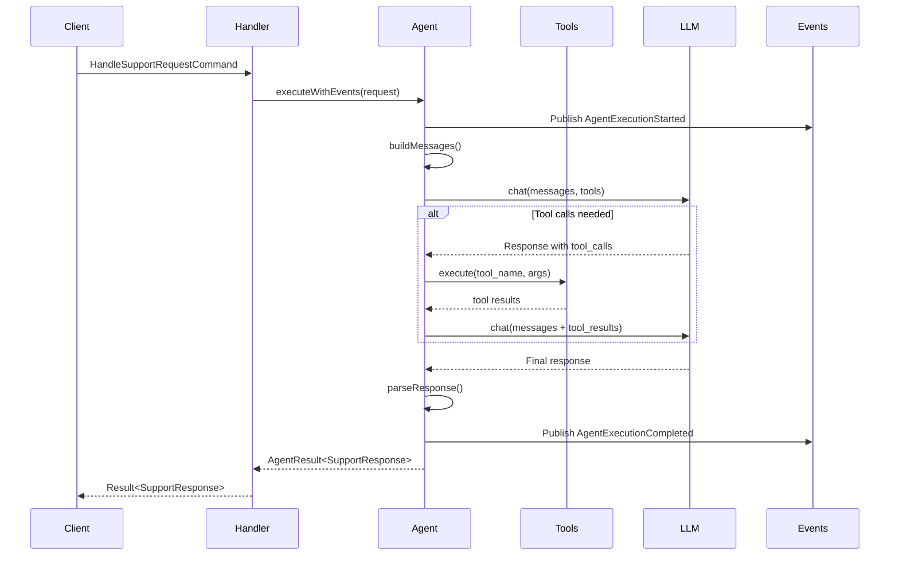

# Architecture Documentation

## Overview

The Enterprise Support Agent is a production-ready example demonstrating advanced patterns in the Stratix framework. It implements a comprehensive AI-powered customer support system using Domain-Driven Design (DDD), CQRS, and hexagonal architecture.

## Architectural Patterns

### 1. Domain-Driven Design (DDD)

#### Bounded Context

The `EnterpriseSupportContext` encapsulates all enterprise support functionality:

```typescript
export class EnterpriseSupportContext implements Context {
  readonly metadata: ContextMetadata = {
    name: 'enterprise-support-context',
    version: '2.0.0',
    description: 'Enterprise-grade customer support with AI agent and tool integration',
  };
}
```

#### Aggregates

**EnterpriseSupportAgent** is the main aggregate root:
- Extends `AIAgent<SupportRequest, SupportResponse>`
- Manages agent execution lifecycle
- Publishes domain events
- Encapsulates business logic for support request handling

**SupportTicket** is a secondary aggregate:
- Independent lifecycle from the agent
- Managed through repository pattern
- Has its own state transitions

#### Value Objects

Immutable objects representing domain concepts:
- `SupportRequest` - Customer request with metadata
- `SupportResponse` - Agent response with categorization
- `SentimentAnalysis` - Sentiment score and label
- `OrderInfo` - Order details and tracking
- `KnowledgeArticle` - Help documentation

#### Domain Events

All state changes publish events:
- `AgentExecutionStarted` - Agent begins processing
- `AgentExecutionCompleted` - Agent finished successfully
- `AgentExecutionFailed` - Execution encountered error
- `AgentContextUpdated` - Agent context modified
- `AgentToolUsed` - Tool was invoked

### 2. CQRS (Command Query Responsibility Segregation)

Separate models for writes and reads:

#### Commands (Write Operations)

```typescript
interface HandleSupportRequestCommand extends Command {
  readonly request: SupportRequest;
}

class HandleSupportRequestHandler implements CommandHandler {
  async handle(command: HandleSupportRequestCommand): Promise<Result<SupportResponse, Error>>
}
```

Commands:
- Modify state
- Return success/failure
- Publish domain events
- Execute through command handlers

#### Queries (Read Operations)

```typescript
interface GetCustomerTicketsQuery extends Query {
  readonly customerId: string;
  readonly limit?: number;
  readonly status?: TicketStatus;
}

class GetCustomerTicketsHandler implements QueryHandler {
  async handle(query: GetCustomerTicketsQuery): Promise<Result<SupportTicket[], Error>>
}
```

Queries:
- Read-only operations
- No side effects
- Optimized for retrieval
- Execute through query handlers

### 3. Hexagonal Architecture (Ports & Adapters)

#### Domain Layer (Core)

Pure business logic, no external dependencies:

```
domain/
├── EnterpriseAgent.ts        # Core agent logic
└── types.ts                  # Domain value objects
```

**Responsibilities:**
- Business rules and invariants
- Domain modeling
- Core algorithms
- Event publishing

**Dependencies:** None (except @stratix/core abstractions)

#### Application Layer

Use cases and orchestration:

```
application/
├── commands/
│   └── HandleSupportRequest.ts
└── queries/
    ├── GetTicketDetails.ts
    └── GetCustomerTickets.ts
```

**Responsibilities:**
- Coordinate domain objects
- Execute use cases
- Transaction boundaries
- Error handling

**Dependencies:** Domain layer only

#### Infrastructure Layer

Technical implementations and adapters:

```
infrastructure/
├── tools/
│   ├── QueryKnowledgeBaseTool.ts
│   ├── CheckOrderStatusTool.ts
│   └── CreateSupportTicketTool.ts
└── repositories/
    └── TicketRepository.ts
```

**Responsibilities:**
- External integrations
- Data persistence
- Tool implementations
- Technical concerns

**Dependencies:** All layers

### 4. Tool Integration Pattern

Tools provide structured capabilities to the AI agent:

```typescript
export class QueryKnowledgeBaseTool extends AgentTool<Input, Output> {
  readonly name = 'query_knowledge_base';
  readonly description = 'Search the knowledge base';
  readonly requiresApproval = false;

  async execute(input: Input): Promise<Output> {
    // Implementation
  }

  async validate(input: unknown): Promise<Input> {
    // Validation
  }

  getDefinition(): ToolDefinition {
    // OpenAI function calling format
  }
}
```

**Key Characteristics:**
- Type-safe inputs and outputs
- Validation before execution
- Structured definitions for LLM
- Optional approval requirements
- Error handling

### 5. Repository Pattern

Abstract data access:

```typescript
interface TicketRepository extends Repository<SupportTicket> {
  findById(id: string): Promise<SupportTicket | null>;
  findByCustomerId(customerId: string, options?: FindOptions): Promise<SupportTicket[]>;
  save(ticket: SupportTicket): Promise<void>;
  update(ticket: SupportTicket): Promise<void>;
  delete(id: string): Promise<void>;
}
```

**Benefits:**
- Abstraction over persistence
- Easy to test with mocks
- Swappable implementations
- Domain-focused interface

### 6. Result Pattern

Explicit error handling without exceptions:

```typescript
type Result<T, E> = Success<T> | Failure<E>;

const result = await handler.handle(command);

if (result.isSuccess) {
  // Access result.value
} else {
  // Handle result.error
}
```

**Advantages:**
- Explicit error handling
- Type-safe error propagation
- No hidden control flow
- Composable operations

## System Architecture

### Component Diagram



### Execution Flow



## Data Flow

### 1. Support Request Processing

```
User Input
    ↓
HandleSupportRequestCommand
    ↓
HandleSupportRequestHandler
    ↓
EnterpriseSupportAgent.executeWithEvents()
    ↓
    ├─→ Publish AgentExecutionStarted event
    ├─→ Build context-aware messages
    ├─→ Get tool definitions from registry
    ├─→ Call LLM with tools
    │   ↓
    │   ├─→ LLM decides to use tools
    │   ├─→ Execute tools (KB search, order check, etc.)
    │   ├─→ Add tool results to conversation
    │   └─→ Get final response from LLM
    ↓
Parse JSON response
    ↓
Create SupportResponse
    ↓
Publish AgentExecutionCompleted event
    ↓
Return Result<SupportResponse>
```

### 2. Tool Execution Flow

```
LLM requests tool use
    ↓
ToolRegistry.getTool(name)
    ↓
Tool.validate(input)
    ↓
Tool.execute(input)
    ↓
    ├─→ QueryKnowledgeBaseTool
    │   └─→ Search knowledge base
    │       └─→ Return relevant articles
    │
    ├─→ CheckOrderStatusTool
    │   └─→ Query order system
    │       └─→ Return order details
    │
    └─→ CreateSupportTicketTool
        └─→ Generate ticket ID
        └─→ Assign to team
        └─→ Save ticket
        └─→ Return ticket info
```

## Key Design Decisions

### 1. Why Tool Integration?

**Decision:** Integrate tools for external data access instead of embedding all data in prompts.

**Rationale:**
- Reduces token usage (cheaper)
- Enables real-time data
- Separates concerns
- More scalable
- Better testability

**Trade-offs:**
- More complex implementation
- Additional latency for tool calls
- Requires LLM with function calling support

### 2. Why CQRS?

**Decision:** Separate command and query operations.

**Rationale:**
- Clear separation of concerns
- Optimized read/write models
- Independent scaling
- Explicit operations
- Better testability

**Trade-offs:**
- More boilerplate code
- Learning curve
- Potential data consistency challenges

### 3. Why In-Memory Implementations?

**Decision:** Use in-memory repositories and tools for the example.

**Rationale:**
- Easy to run and test
- No external dependencies
- Focus on architecture
- Clear implementation patterns

**Production Consideration:**
- Replace with real databases
- Add caching layers
- Implement proper error handling
- Add monitoring and logging

### 4. Why Result Pattern?

**Decision:** Use Result<T, E> instead of throwing exceptions.

**Rationale:**
- Explicit error handling
- Type-safe error propagation
- No hidden control flow
- Functional programming style
- Composable operations

**Trade-offs:**
- More verbose error handling
- Requires discipline
- Different from typical JS/TS patterns

### 5. Why GPT-4o vs GPT-4o-mini?

**Decision:** Use GPT-4o by default (can be changed to mini).

**Rationale:**
- Better tool calling capabilities
- More accurate categorization
- Better sentiment analysis
- More coherent responses

**Production Consideration:**
- Use GPT-4o-mini for cost optimization
- A/B test both models
- Route simple queries to mini, complex to full
- Monitor quality metrics

## Extension Points

### 1. Adding New Tools

```typescript
// 1. Create tool class
export class CheckInventoryTool extends AgentTool<Input, Output> {
  // Implementation
}

// 2. Register in context
constructor(llmProvider: LLMProvider) {
  const inventoryTool = new CheckInventoryTool();
  this.toolRegistry.registerTool(inventoryTool);
}
```

### 2. Adding New Commands

```typescript
// 1. Define command
interface EscalateTicketCommand extends Command {
  ticketId: string;
  reason: string;
}

// 2. Create handler
class EscalateTicketHandler implements CommandHandler {
  async handle(command: EscalateTicketCommand) {
    // Implementation
  }
}

// 3. Register in context
getCommands(): ContextCommandDefinition[] {
  return [
    // ... existing commands
    {
      name: 'EscalateTicket',
      commandType: {} as new () => EscalateTicketCommand,
      handler: new EscalateTicketHandler(),
    },
  ];
}
```

### 3. Adding New Queries

```typescript
// 1. Define query
interface GetTicketsByPriorityQuery extends Query {
  priority: Priority;
  limit: number;
}

// 2. Create handler
class GetTicketsByPriorityHandler implements QueryHandler {
  async handle(query: GetTicketsByPriorityQuery) {
    // Implementation
  }
}

// 3. Register in context
getQueries(): ContextQueryDefinition[] {
  return [
    // ... existing queries
    {
      name: 'GetTicketsByPriority',
      queryType: {} as new () => GetTicketsByPriorityQuery,
      handler: new GetTicketsByPriorityHandler(),
    },
  ];
}
```

### 4. Integrating Real Databases

```typescript
import { Pool } from 'pg';

export class PostgresTicketRepository implements TicketRepository {
  constructor(private pool: Pool) {}

  async findById(id: string): Promise<SupportTicket | null> {
    const result = await this.pool.query(
      'SELECT * FROM tickets WHERE id = $1',
      [id]
    );

    if (result.rows.length === 0) return null;

    return this.mapRowToTicket(result.rows[0]);
  }

  private mapRowToTicket(row: any): SupportTicket {
    return {
      id: row.id,
      customerId: row.customer_id,
      subject: row.subject,
      description: row.description,
      category: row.category,
      priority: row.priority,
      status: row.status,
      assignedTo: row.assigned_to,
      createdAt: new Date(row.created_at),
      updatedAt: new Date(row.updated_at),
      resolvedAt: row.resolved_at ? new Date(row.resolved_at) : undefined,
      tags: row.tags,
    };
  }
}
```

### 5. Adding Vector Store for RAG

```typescript
import { InMemoryVectorStore } from '@stratix/runtime';

export class VectorKnowledgeBaseTool extends AgentTool<Input, Output> {
  constructor(private vectorStore: InMemoryVectorStore) {
    super();
  }

  async execute(input: { query: string }): Promise<Output> {
    // Generate embedding for query
    const embedding = await this.generateEmbedding(input.query);

    // Similarity search
    const results = await this.vectorStore.similaritySearch({
      vector: embedding,
      k: 3,
    });

    return {
      articles: results.map(r => r.metadata as KnowledgeArticle),
      totalFound: results.length,
    };
  }
}
```

## Testing Strategy

### Unit Tests

Test individual components in isolation:

```typescript
describe('QueryKnowledgeBaseTool', () => {
  it('should return relevant articles', async () => {
    const tool = new QueryKnowledgeBaseTool();
    const result = await tool.execute({ query: 'refund' });
    expect(result.articles.length).toBeGreaterThan(0);
  });
});
```

### Integration Tests

Test component interactions:

```typescript
describe('EnterpriseSupportAgent Integration', () => {
  it('should handle request with tool usage', async () => {
    const context = new EnterpriseSupportContext(mockProvider);
    const command = { request: { customerId: 'test', message: 'help' } };
    const result = await context.getSupportRequestHandler().handle(command);
    expect(result.isSuccess).toBe(true);
  });
});
```

### E2E Tests

Test full workflows:

```typescript
describe('Support Workflow E2E', () => {
  it('should process support request and create ticket', async () => {
    // 1. Submit support request
    const response = await handleSupportRequest();

    // 2. Verify ticket created
    const tickets = await getCustomerTickets();
    expect(tickets.length).toBe(1);

    // 3. Verify escalation if needed
    if (response.requiresEscalation) {
      expect(tickets[0].assignedTo).toContain('senior');
    }
  });
});
```

## Performance Considerations

### 1. Token Usage Optimization

- Use tool calling instead of embedding large contexts
- Stream responses for better UX
- Cache knowledge base results
- Implement token counting and limits

### 2. Latency Reduction

- Parallel tool execution where possible
- Cache LLM responses for common queries
- Use faster models (mini) for simple requests
- Implement request queuing and batching

### 3. Cost Management

- Monitor token usage per request
- Set budget limits per customer tier
- Use cheaper models when appropriate
- Cache and reuse responses

### 4. Scalability

- Stateless agent design
- Horizontal scaling of handlers
- Database connection pooling
- Event-driven architecture for async processing

## Security Considerations

### 1. Input Validation

All tool inputs are validated:

```typescript
async validate(input: unknown): Promise<ValidInput> {
  if (typeof input !== 'object' || input === null) {
    throw new Error('Input must be an object');
  }
  // Strict validation
}
```

### 2. Tool Approval

Sensitive tools require approval:

```typescript
export class DeleteDataTool extends AgentTool {
  readonly requiresApproval = true; // Human approval needed
}
```

### 3. PII Protection

Implement guardrails for sensitive data:

```typescript
import { PIIGuardrail } from '@stratix/runtime';

const guardrail = new PIIGuardrail({ redactPII: true });
```

### 4. Rate Limiting

Prevent abuse:

```typescript
import { TokenBucketRateLimiter } from '@stratix/runtime';

const limiter = new TokenBucketRateLimiter({
  capacity: 100,
  refillRate: 10,
});
```

## Monitoring and Observability

### 1. Domain Events

Subscribe to events for monitoring:

```typescript
eventBus.subscribe('AgentExecutionCompleted', (event) => {
  metrics.record({
    duration: event.metadata.duration,
    tokens: event.metadata.totalTokens,
    cost: event.metadata.cost,
  });
});
```

### 2. Telemetry

Use built-in telemetry:

```typescript
import { InMemoryTelemetry } from '@stratix/runtime';

const telemetry = new InMemoryTelemetry();
```

### 3. Logging

Structured logging for debugging:

```typescript
import { ConsoleLogger } from '@stratix/runtime';

const logger = new ConsoleLogger({ level: 'info' });
```

## Future Enhancements

1. **Workflow Engine Integration** - Complex multi-step workflows
2. **RAG Pipeline** - Vector store integration for better KB search
3. **Guardrails** - Content filtering and safety checks
4. **Multi-Agent Orchestration** - Specialized agents for different categories
5. **Real-time Streaming** - Stream responses to users
6. **Analytics Dashboard** - Monitor agent performance and costs
7. **A/B Testing** - Compare different prompts and models
8. **Custom Training** - Fine-tune models on support data
