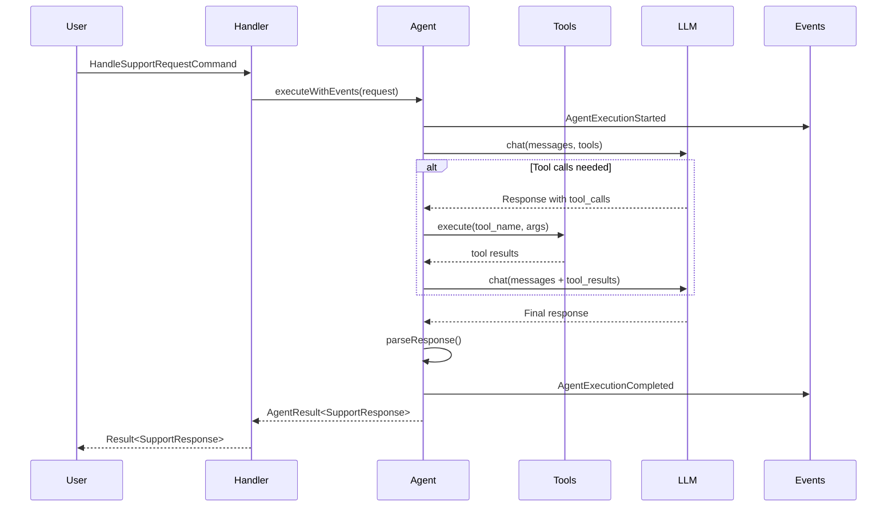

# Enterprise Support Agent Example

This example demonstrates a production-ready, enterprise-grade AI customer support agent built with the Stratix framework. It showcases advanced features including tool integration, knowledge base search, sentiment analysis, and intelligent escalation.

## Features

### AI Agent Capabilities
- Context-aware response generation
- Multi-turn conversation support
- Sentiment analysis and emotion detection
- Automatic priority assignment
- Intelligent escalation to human agents
- Multi-language support (auto-detection)

### Tool Integration
1. **Knowledge Base Search** - Semantic search through help articles and documentation
2. **Order Status Checker** - Real-time order tracking and details
3. **Ticket Creator** - Automatic support ticket creation and routing

### Enterprise Features
- CQRS pattern with commands and queries
- Repository pattern for data persistence
- Domain-Driven Design (DDD) architecture
- Event sourcing with domain events
- Bounded context isolation
- Type-safe tool definitions

## Project Structure

```
enterprise-support-agent/
├── domain/
│   ├── EnterpriseAgent.ts          # AI Agent with tool support
│   └── types.ts                     # Domain types and value objects
├── application/
│   ├── commands/
│   │   └── HandleSupportRequest.ts # Command for handling support requests
│   └── queries/
│       ├── GetTicketDetails.ts     # Query for ticket details
│       └── GetCustomerTickets.ts   # Query for customer ticket history
├── infrastructure/
│   ├── tools/
│   │   ├── QueryKnowledgeBaseTool.ts    # Knowledge base search tool
│   │   ├── CheckOrderStatusTool.ts      # Order tracking tool
│   │   └── CreateSupportTicketTool.ts   # Ticket creation tool
│   └── repositories/
│       └── TicketRepository.ts          # Ticket persistence
├── tests/
│   └── EnterpriseAgent.test.ts     # Comprehensive tests
├── EnterpriseSupportContext.ts     # Bounded context
├── example-usage.ts                # Usage examples
└── README.md
```

## Installation

```bash
cd examples/enterprise-support-agent
pnpm install
```

## Configuration

### 1. Set up OpenAI API Key

```bash
export OPENAI_API_KEY=sk-your-api-key-here
```

Or create a `.env` file:
```bash
cp .env.example .env
# Edit .env and add your API key
```

Get your API key from [OpenAI Platform](https://platform.openai.com/api-keys)

### 2. Cost Information

This example uses GPT-4o which has the following pricing:
- Input: $2.50 per 1M tokens
- Output: $10.00 per 1M tokens

Each interaction typically uses 500-1500 tokens, costing approximately $0.01-$0.02 per request.

For more economical usage, you can switch to `gpt-4o-mini` in `domain/EnterpriseAgent.ts`:
```typescript
readonly model: ModelConfig = {
  provider: 'openai',
  model: 'gpt-4o-mini', // $0.15/$0.60 per 1M tokens
  temperature: 0.7,
  maxTokens: 2000,
};
```

## Usage

### Run the Example

```bash
pnpm start
```

The example demonstrates:
1. Technical support with knowledge base integration
2. Billing queries with order tracking
3. Complaint handling with auto-escalation
4. Multi-turn conversations
5. Ticket history retrieval
6. Multi-language support

### Run Tests

```bash
pnpm test
```

### Type Check

```bash
pnpm typecheck
```

## Architecture

### Layered Architecture

```
┌─────────────────────────────────────┐
│     example-usage.ts (Entry)        │
└──────────────┬──────────────────────┘
               │
               ▼
┌─────────────────────────────────────┐
│   EnterpriseSupportContext          │
│   (Bounded Context Orchestration)   │
└──────────────┬──────────────────────┘
               │
      ┌────────┴────────┐
      ▼                 ▼
┌─────────────┐   ┌────────────────┐
│ Application │   │    Domain      │
│   Layer     │   │     Layer      │
│             │   │                │
│ - Commands  │◄──┤ EnterpriseAgent│
│ - Queries   │   │ - Types        │
│ - Handlers  │   │ - Events       │
└──────┬──────┘   └────────────────┘
       │
       ▼
┌─────────────────────────────────────┐
│      Infrastructure Layer           │
│  - Tools (KB, Orders, Tickets)      │
│  - Repositories                     │
│  - External Integrations            │
└─────────────────────────────────────┘
```

### Execution Flow



## Key Concepts

### 1. AI Agent with Tools

The `EnterpriseSupportAgent` can use tools to gather information:

```typescript
const agent = new EnterpriseSupportAgent(
  id,
  createdAt,
  updatedAt,
  llmProvider,
  toolRegistry // Tools are registered here
);
```

### 2. Tool Integration

Tools extend `AgentTool` and provide structured capabilities:

```typescript
export class QueryKnowledgeBaseTool extends AgentTool<Input, Output> {
  readonly name = 'query_knowledge_base';
  readonly description = 'Search the knowledge base';

  async execute(input: Input): Promise<Output> {
    // Implementation
  }

  getDefinition(): ToolDefinition {
    // OpenAI function calling format
  }
}
```

### 3. CQRS Pattern

Separate read and write operations:

**Commands (Write):**
```typescript
interface HandleSupportRequestCommand extends Command {
  readonly request: SupportRequest;
}
```

**Queries (Read):**
```typescript
interface GetCustomerTicketsQuery extends Query {
  readonly customerId: string;
  readonly limit?: number;
}
```

### 4. Result Pattern

Explicit error handling without exceptions:

```typescript
const result = await handler.handle(command);

if (result.isSuccess) {
  console.log(result.value);
} else {
  console.error(result.error);
}
```

### 5. Domain Events

All agent executions publish events:

```typescript
const events = agent.pullDomainEvents();
// Events: AgentExecutionStarted, AgentExecutionCompleted, etc.
```

## Advanced Usage

### Custom Tools

Create custom tools for your domain:

```typescript
export class CheckInventoryTool extends AgentTool<
  { productId: string },
  { inStock: boolean; quantity: number }
> {
  readonly name = 'check_inventory';
  readonly description = 'Check product inventory';

  async execute(input: { productId: string }) {
    // Your implementation
    return { inStock: true, quantity: 42 };
  }

  async validate(input: unknown) {
    // Validation logic
    return input as { productId: string };
  }

  getDefinition(): ToolDefinition {
    return {
      name: this.name,
      description: this.description,
      parameters: {
        type: 'object',
        properties: {
          productId: { type: 'string' },
        },
        required: ['productId'],
      },
    };
  }
}

// Register the tool
toolRegistry.registerTool(new CheckInventoryTool());
```

### Using Different LLM Providers

Switch to Anthropic Claude:

```typescript
import { AnthropicProvider } from '@stratix/ai-anthropic';

const anthropicProvider = new AnthropicProvider({
  apiKey: process.env.ANTHROPIC_API_KEY!,
  models: [
    {
      name: 'claude-3-5-sonnet-20241022',
      pricing: {
        input: 3.0,   // $3.00 per 1M tokens
        output: 15.0  // $15.00 per 1M tokens
      }
    }
  ]
});

const context = new EnterpriseSupportContext(anthropicProvider);
```

Update the agent's model:

```typescript
readonly model: ModelConfig = {
  provider: 'anthropic',
  model: 'claude-3-5-sonnet-20241022',
  temperature: 0.7,
  maxTokens: 2000,
};
```

### Adding Persistence

Replace in-memory repository with real database:

```typescript
import { Pool } from 'pg';

export class PostgresTicketRepository implements TicketRepository {
  constructor(private pool: Pool) {}

  async findById(id: string): Promise<SupportTicket | null> {
    const result = await this.pool.query(
      'SELECT * FROM tickets WHERE id = $1',
      [id]
    );
    return result.rows[0] || null;
  }

  async save(ticket: SupportTicket): Promise<void> {
    await this.pool.query(
      'INSERT INTO tickets (id, customer_id, subject, ...) VALUES ($1, $2, $3, ...)',
      [ticket.id, ticket.customerId, ticket.subject, ...]
    );
  }
}
```

## Testing

The example includes comprehensive tests:

```typescript
import { createTestApp, MockLLMProvider, expectSuccess } from '@stratix/testing';

describe('EnterpriseSupportAgent', () => {
  it('should handle support request with tools', async () => {
    const mockProvider = new MockLLMProvider();
    const context = new EnterpriseSupportContext(mockProvider);

    const command: HandleSupportRequestCommand = {
      request: {
        customerId: 'test-customer',
        message: 'I need help with my order',
      },
    };

    const result = await context.getSupportRequestHandler().handle(command);

    expectSuccess(result);
    expect(result.value.category).toBe('general');
  });
});
```

## Production Considerations

### 1. Rate Limiting

Implement rate limiting for API calls:

```typescript
import { TokenBucketRateLimiter } from '@stratix/runtime';

const rateLimiter = new TokenBucketRateLimiter({
  capacity: 100,
  refillRate: 10,
});
```

### 2. Monitoring

Subscribe to domain events for monitoring:

```typescript
eventBus.subscribe('AgentExecutionCompleted', async (event) => {
  await metrics.record({
    agent: event.agentName,
    duration: event.metadata.duration,
    tokens: event.metadata.totalTokens,
    cost: event.metadata.cost,
  });
});
```

### 3. Guardrails

Add content filtering and safety checks:

```typescript
import { StandardGuardrailChain, PIIGuardrail } from '@stratix/runtime';

const guardrails = new StandardGuardrailChain({
  guardrails: [
    new PIIGuardrail({ redactPII: true }),
    new PromptInjectionGuardrail(),
  ],
});
```

### 4. Vector Store Integration

Replace keyword search with semantic search:

```typescript
import { InMemoryVectorStore } from '@stratix/runtime';

const vectorStore = new InMemoryVectorStore();

// In QueryKnowledgeBaseTool
async execute(input: KnowledgeBaseQuery): Promise<KnowledgeBaseResult> {
  const results = await vectorStore.similaritySearch({
    query: input.query,
    k: 3,
  });

  return { articles: results, totalFound: results.length };
}
```

## Best Practices

1. **Use Tools Strategically** - Only provide tools the agent actually needs
2. **Validate Tool Inputs** - Always validate and sanitize tool inputs
3. **Monitor Costs** - Track token usage and costs per interaction
4. **Handle Errors Gracefully** - Use Result pattern consistently
5. **Test Thoroughly** - Write tests for all commands, queries, and tools
6. **Document Tools** - Provide clear descriptions for tool definitions
7. **Version Your Agents** - Use semantic versioning for agent capabilities
8. **Log Domain Events** - Use events for audit trails and analytics

## Resources

- [Stratix Documentation](../../README.md)
- [OpenAI Function Calling Guide](https://platform.openai.com/docs/guides/function-calling)
- [DDD Best Practices](https://martinfowler.com/bliki/DomainDrivenDesign.html)
- [CQRS Pattern](https://martinfowler.com/bliki/CQRS.html)

## License

MIT
