# @Logger Decorator Architecture

This document explains the internal architecture and flow of the `@Logger` property decorator.

## Architecture Overview

```mermaid
graph TB
    subgraph "Application Layer"
        A[Command Handler]
        B[Event Handler]
        C[Domain Service]
    end

    subgraph "Decorator Layer"
        D[@Logger Decorator]
        E[MetadataStorage]
    end

    subgraph "Runtime Layer"
        F[StratixApplication]
        G[DI Container]
    end

    subgraph "Infrastructure Layer"
        H[StratixLogger]
        I[Logger Interface]
    end

    A -->|uses| D
    B -->|uses| D
    C -->|uses| D
    D -->|stores metadata| E
    D -->|resolves from| G
    F -->|registers| H
    G -->|provides| H
    H -->|implements| I
```

## Initialization Flow

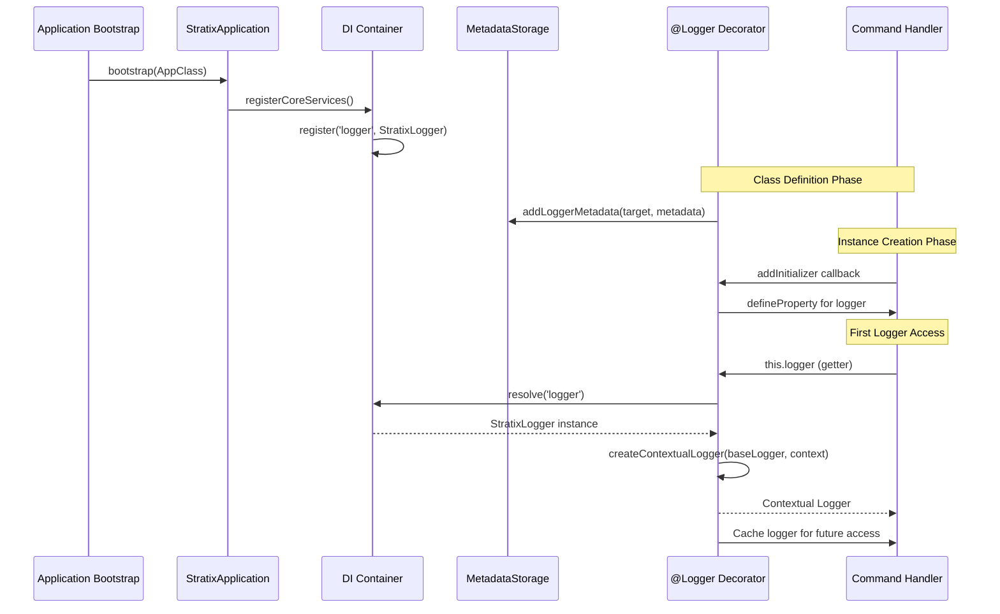

## Property Decorator Flow

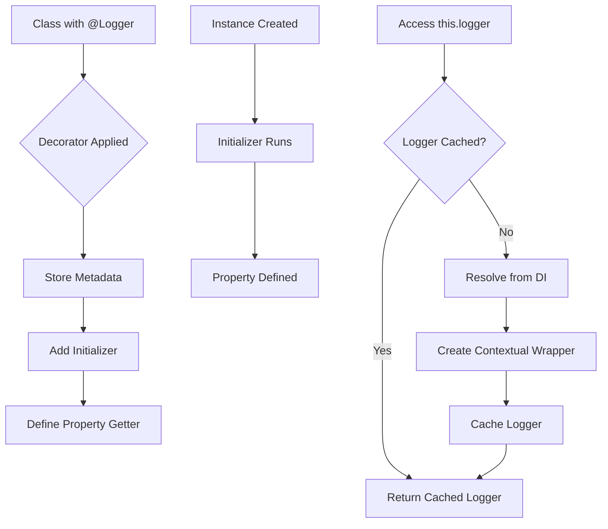

## Logger Resolution Strategy

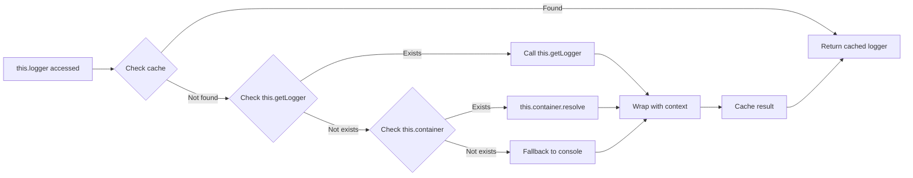

## Contextual Logger Wrapper

The decorator wraps the base logger to automatically include context:

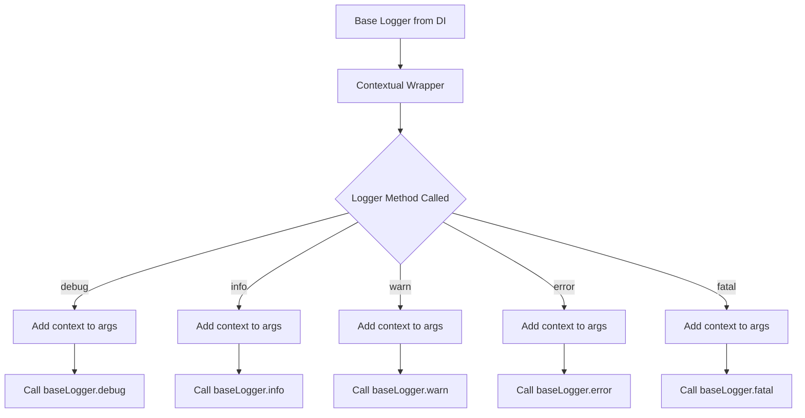

## Multiple Loggers in Same Class

```mermaid
graph TB
    subgraph "PaymentService Class"
        A[@Logger context: 'Payments']
        B[@Logger context: 'Security']
        C[@Logger context: 'Performance']
    end

    subgraph "Metadata Storage"
        D[Payments metadata]
        E[Security metadata]
        F[Performance metadata]
    end

    subgraph "DI Container"
        G[Base Logger]
    end

    subgraph "Contextual Loggers"
        H[Payments Logger]
        I[Security Logger]
        J[Performance Logger]
    end

    A -->|stores| D
    B -->|stores| E
    C -->|stores| F

    A -->|resolves| G
    B -->|resolves| G
    C -->|resolves| G

    A -->|creates| H
    B -->|creates| I
    C -->|creates| J

    H -->|wraps| G
    I -->|wraps| G
    J -->|wraps| G
```

## Metadata Storage Structure

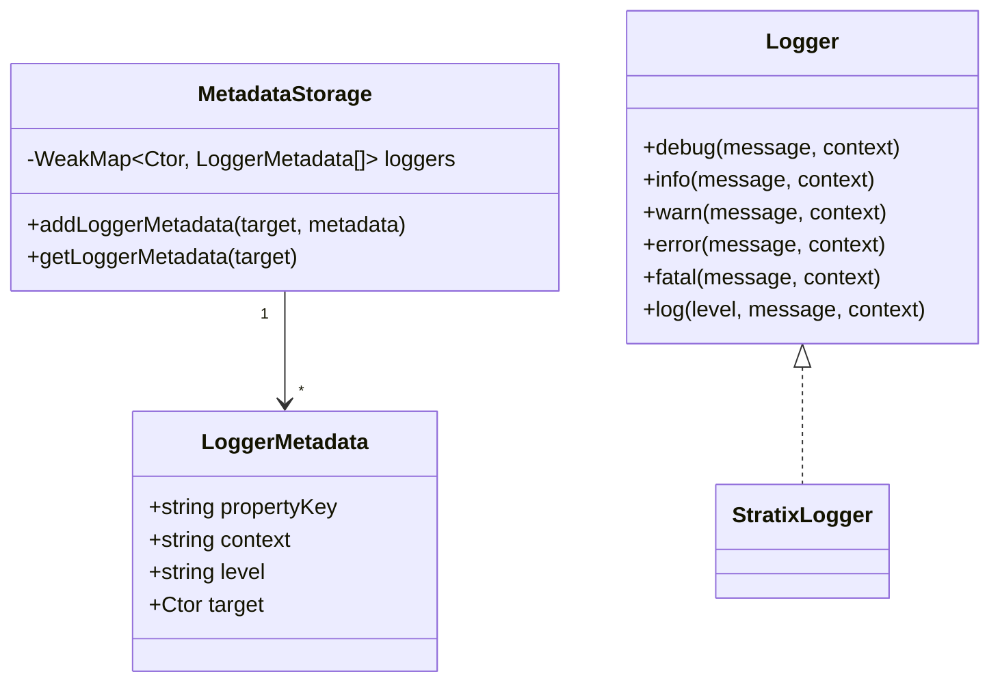

## Log Context Enrichment

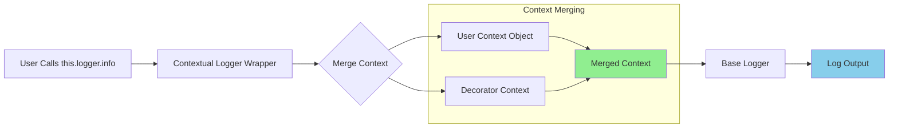

Example:
```typescript
// User code
this.logger.info('Processing order', { orderId: '123' });

// Decorator adds context
// Result: { orderId: '123', context: 'OrderService' }
```

## Lifecycle Comparison

### Without @Logger

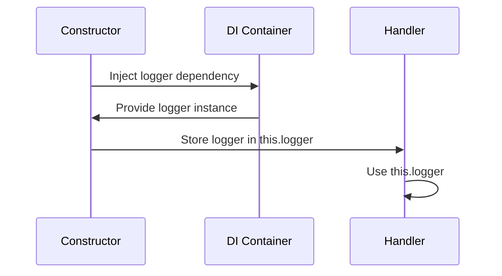

### With @Logger

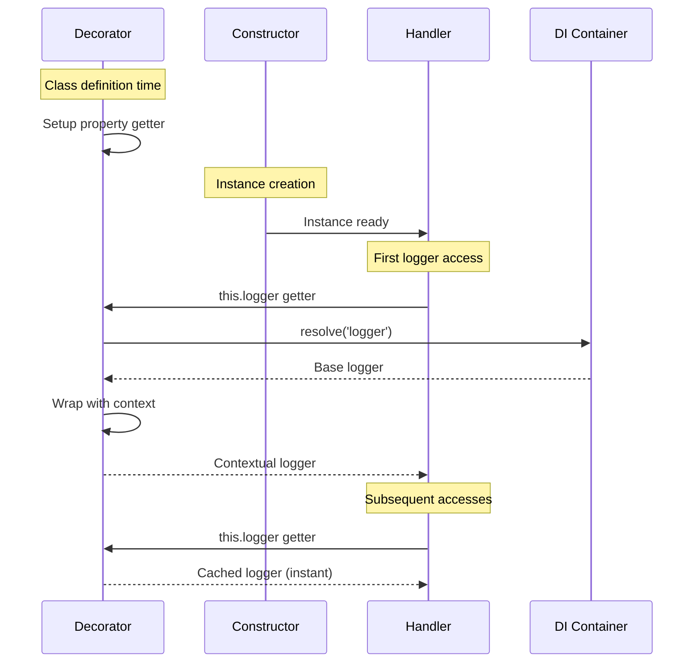

## Error Handling Flow

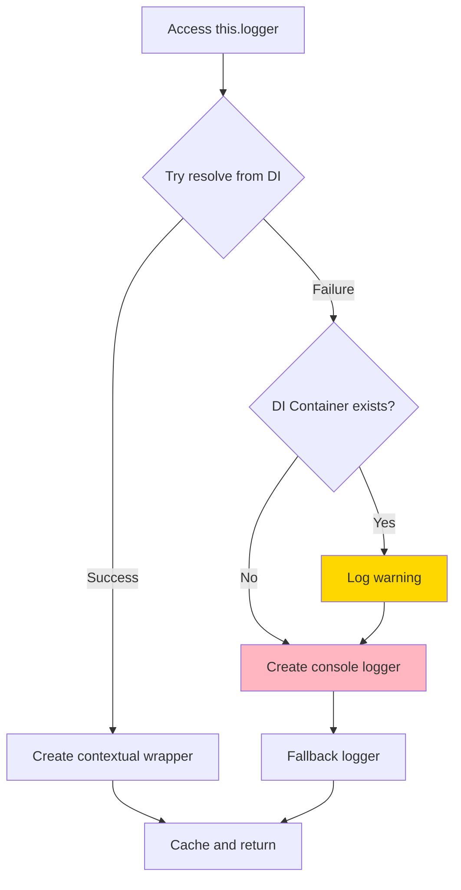

## Performance Optimization

The decorator uses several optimization strategies:

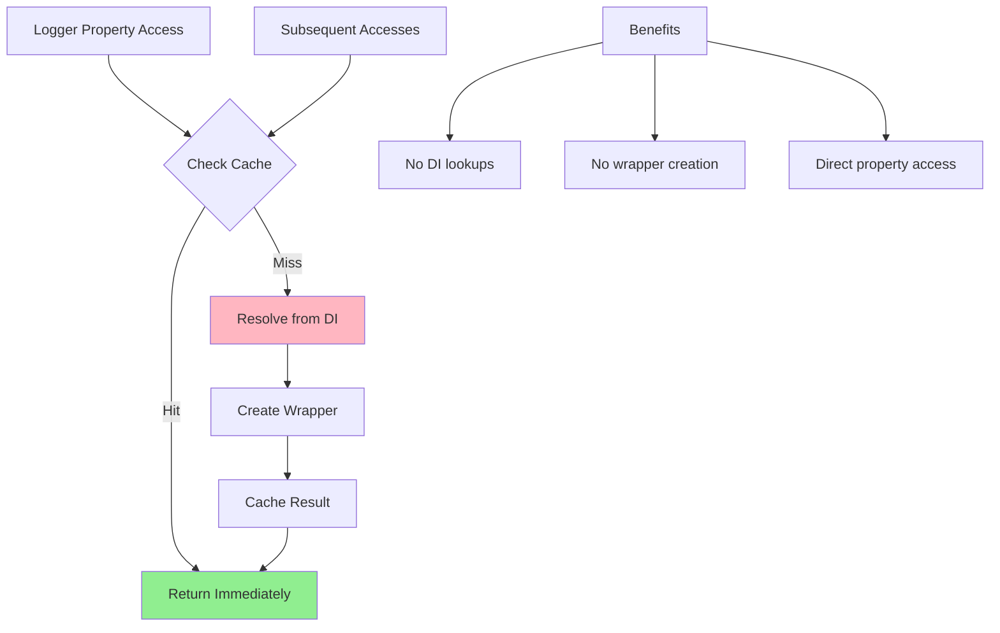

Benefits:
- First access: ~1-2ms (DI resolution + wrapper creation)
- Subsequent accesses: <0.01ms (cached property access)
- Memory: One wrapper instance per logger per class instance

## Integration Points

```mermaid
graph TB
    subgraph "Stratix Core"
        A[Logger Interface]
        B[Container Interface]
    end

    subgraph "Stratix Framework"
        C[@Logger Decorator]
        D[StratixApplication]
        E[MetadataStorage]
        F[StratixLogger]
    end

    subgraph "User Application"
        G[Command Handlers]
        H[Event Handlers]
        I[Domain Services]
    end

    A -->|implemented by| F
    B -->|used by| C
    C -->|used by| G
    C -->|used by| H
    C -->|used by| I
    D -->|registers| F
    C -->|stores in| E
```

## Thread Safety

The decorator is thread-safe in Node.js single-threaded environment:

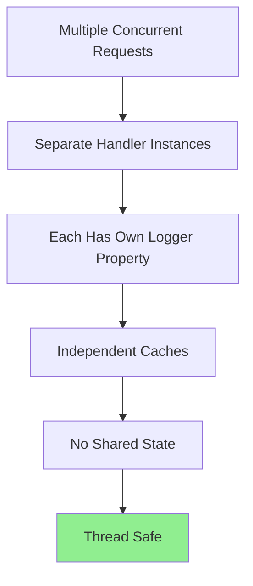

Note: Each class instance has its own cached logger, preventing race conditions.

## Summary

The `@Logger` decorator provides:

1. Automatic dependency injection without constructor parameters
2. Lazy initialization for performance
3. Contextual logging with minimal boilerplate
4. Multiple logger instances per class
5. Type safety with TypeScript
6. Caching for optimal performance
7. Graceful fallbacks when DI is unavailable
8. Clean separation of concerns
